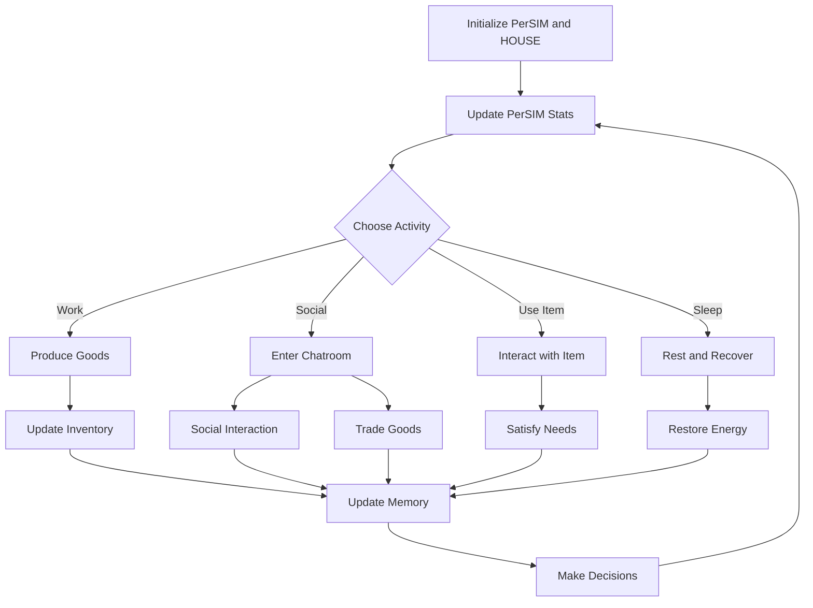
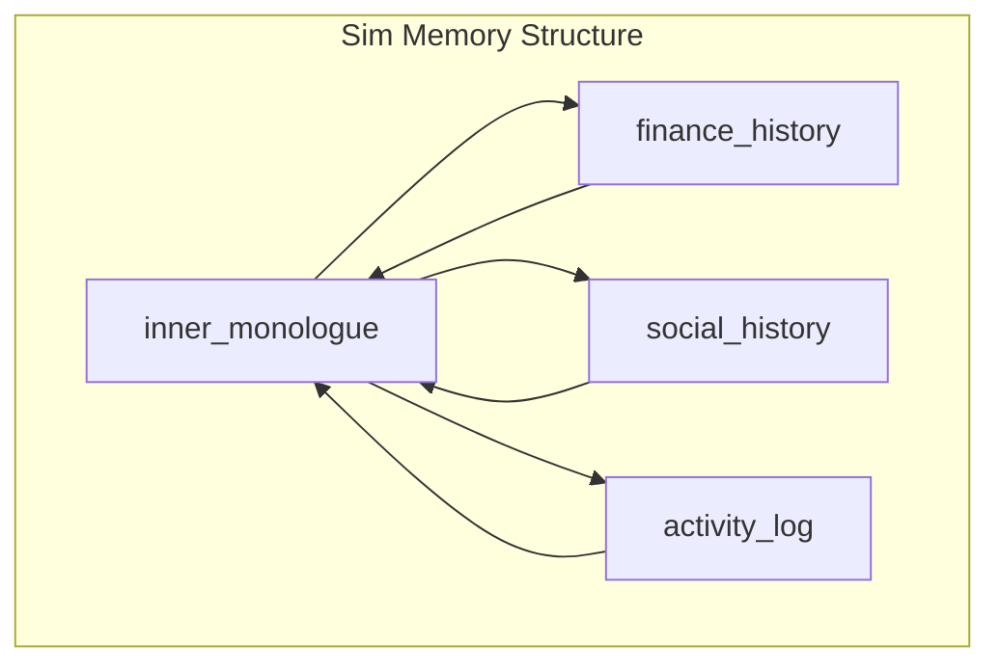
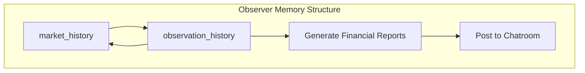
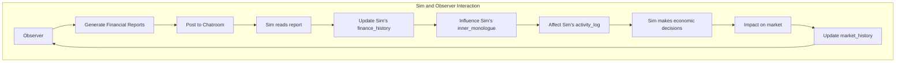

# perSIM module for Economic Simulation and Agent Behavior Overview

# TLDR:

perSIM is a plugin module for LLMs to help simulate their days, grounding their generations and reasoning with self-sustainace and daily chores. Their welfare is tracked across 8 basic human needs, these needs are met by ITEMS that adverise their solutions to x need within their grid environment; the perSIM will automatically pursue the best item for their current need. This will augment our existing proposed Market Agents, by instigating multiple instances of perSIMs encouraging them to socialise and trade according to wlefare, mental state and needs.

## Program Structure

This program is an economic simulation module centered around a single perSIM (simulated person) living in a modest home, these will be instanced for multiple agent perSIMS. Uses Python and leverages Pydantic for data validation and serialization. The main components of the program are:

1. **Simulation**: The core class that manages the entire simulation.
2. **Sim**: Represents the simulated person with various needs and attributes.
3. **House**: Represents the Sim's living space.
4. **Market**: Simulates a economic market.
5. **Item**: Represents objects in the house that the perSim can interact with.

## perSIM Behavior and Mechanics


### Needs System

The perSim has eight fundamental needs:

1. Hunger
2. Hygiene
3. Bladder
4. Energy
5. Social
6. Fun
7. Environment
8. Comfort

Each need is represented by a value from 0 (completely unsatisfied) to 10 (fully satisfied). These needs decay over time and drive the perSim's behavior.

### Mood

The Sim's mood is determined by the overall state of their needs:
- Happy: When needs are generally well-satisfied
- Satisfied: When needs are moderately met
- Stressed: When multiple needs are low

### Decision Making

The perSim makes decisions based on its current needs, mood, and environment. The decision-making process involves:

1. Assessing the lowest need
2. Identifying items in the house that can address that need
3. Moving towards and interacting with the chosen item

### Economic Aspects

- The perSim has a limited amount of money
- Items in the house have purchase and operating costs
- The perSim can work to earn money
- There's a market system where prices and quantities fluctuate

### Interactions and Activities

- The perSim can interact with various items in the house (e.g., bed, fridge, shower)
- Each interaction affects one or more needs
- Some activities (like work) can generate income but may decrease certain needs

### Automatic Behaviors

- Sleep: The perSim will automatically seek rest when energy is very low
- Purchasing: The perSim may automatically buy items if a need is critically low and they have sufficient funds

### Environmental Influences

- The layout of the house affects the Sim's movement and access to items
- The presence or absence of certain items impacts the Sim's ability to satisfy specific needs

## Causes and Effects

1. **Need Decay**
   - Cause: Time passing
   - Effect: Gradual decrease in need satisfaction, influencing mood and decisions

2. **Item Interaction**
   - Cause: perSim uses an item (e.g., fridge, bed)
   - Effect: Increase in related need(s), possible decrease in others (e.g., energy)

3. **Work**
   - Cause: perSim chooses to work
   - Effect: Increases money, decreases energy, may affect other needs

4. **Market Fluctuations**
   - Cause: perSim's purchases and time passing
   - Effect: Changes in item prices and availability

5. **Mood Changes**
   - Cause: Overall state of needs
   - Effect: Influences decision-making priorities

6. **Environmental Constraints**
   - Cause: House layout and available items
   - Effect: Limits or enables certain behaviors and need satisfaction

7. **Economic Decisions**
   - Cause: Limited money and varying item costs
   - Effect: Choices between immediate need satisfaction and long-term planning

8. **Automatic Purchases**
   - Cause: Critical need level and sufficient funds
   - Effect: Immediate money decrease, potential for better need management

9. **Sleep Behavior**
   - Cause: Very low energy
   - Effect: Forced rest, rapid energy recovery, possible neglect of other needs


## CONTEXT MEMORIES FOR PIPING INTO AGENT PROMPTS

Depending on the resolution the agents need, we should use a fast indexed search for fast recall of distant memories. Embedding will slow us down a lot so maybe just keyword freq search is p fine. **I'll also think about search more in the morning. **

### Agent Context Memory:

1. *inner_monologue:* reflections on {activity_log} their {stats} and {mood}. reassess current {goals}.
2. *finance_history:* {transaction_history} {account balance} {assets}
3. *social_history:* {p2p chats with other agents} {chatroom/messageboard interactions}
4. *activity_log:* {sims sequence of their mundane tasks} {recent_actions} {needs_stats} {mood}

Has four distinct memory logs, masking some context while emphasising others through prompting. 

### Financial Observor/and or Environment Context Memory:

1. *market_history:* {all_trades} {global_price} {global_supply_demand} {economic_indicators}
2. *observation_history:* {market_trends} {commentary} {agent_behaviour} {market_history} {chatlogs}

Has two memory tracks their previous observations and the holistic market overview.  

### Trackables:
```
personal_trade_history: A list of trades the agent has participated in.
commodity_price_history: Historical prices for each commodity the agent has interacted with.
past_decisions: A record of decisions made, including context and outcomes.
strategy_performance: Metrics on how well different strategies have performed.
social_interactions: A record of interactions with other agents.
market_beliefs: The agent's beliefs about different commodities in the market.
learning_experiences: Specific scenarios where the agent has learned something.
utility_history: A record of the agent's utility over time.
endowment_history: How the agent's endowment has changed over time.
message_history: A record of messages sent and received.
global_price_history: Historical prices for all commodities in the market.
all_trades: A record of all trades that have occurred in the market.
market_trends: Overall trends for each commodity.
agent_behaviors: Summary of behaviors for each agent in the market.
institution_changes: Record of changes to market institutions and their impacts.
global_supply_demand: Supply and demand information for each commodity.
economic_indicators: Various economic indicators relevant to the market.
```
^ These are copy pasted. **I'll fuss over them in the morning.**

---







