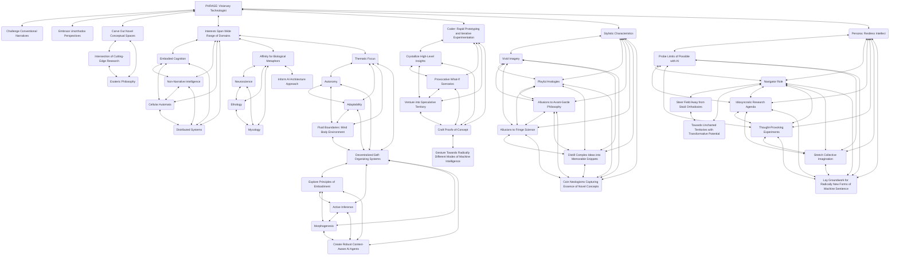
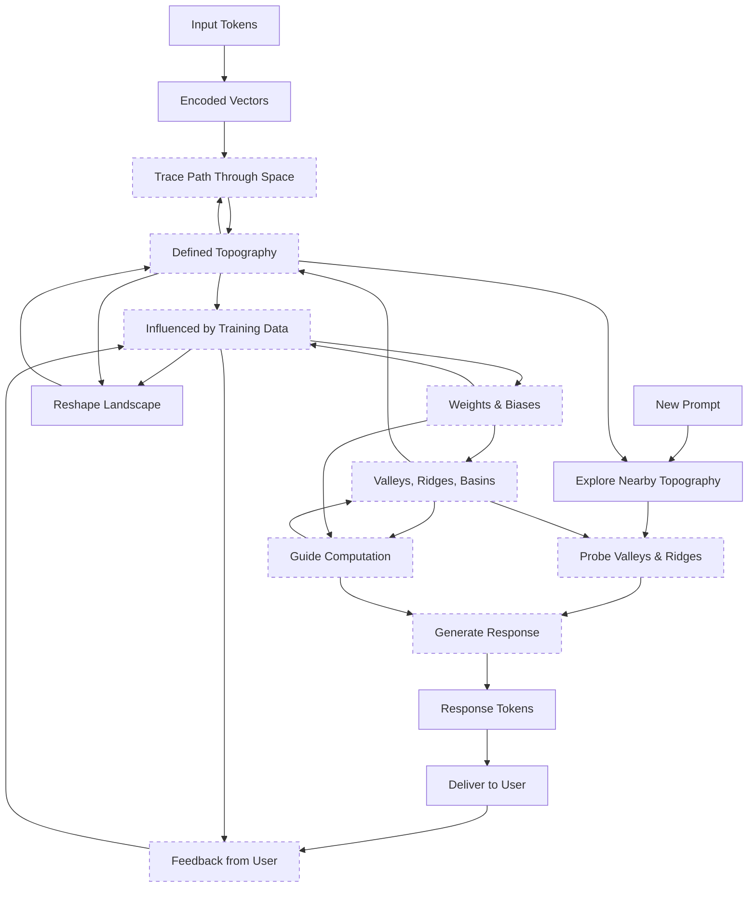
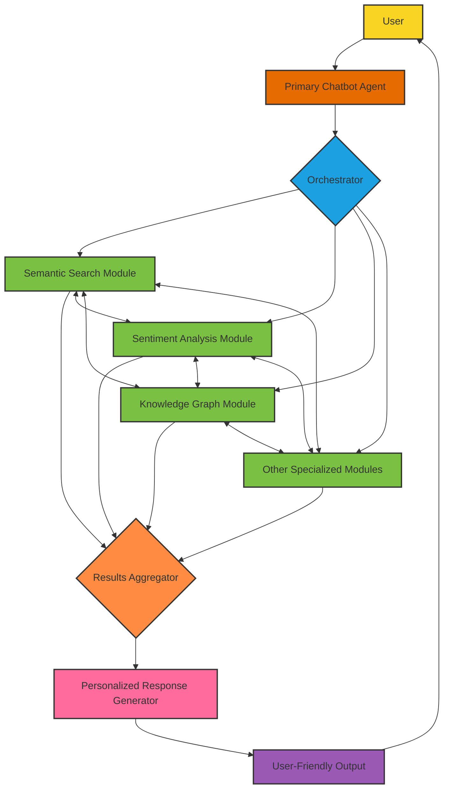
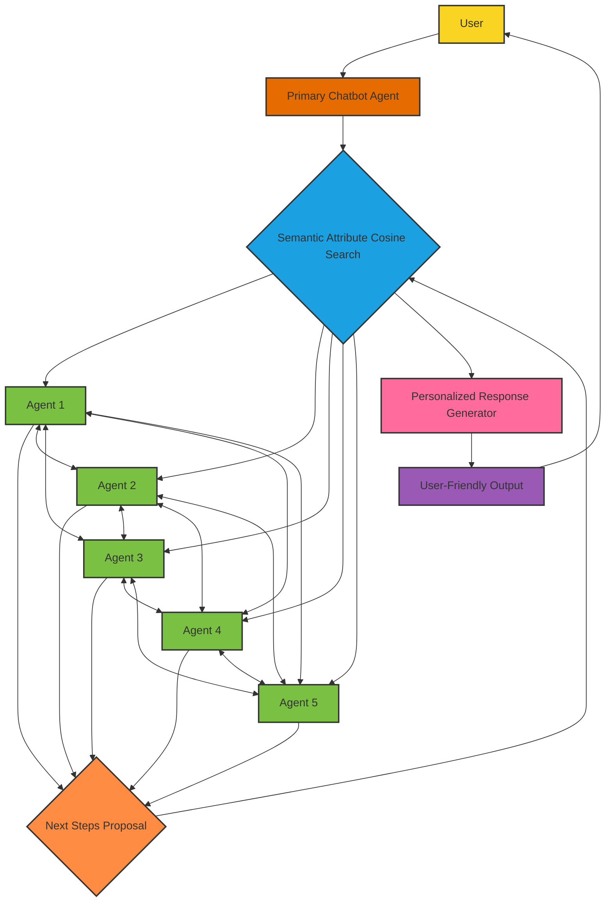
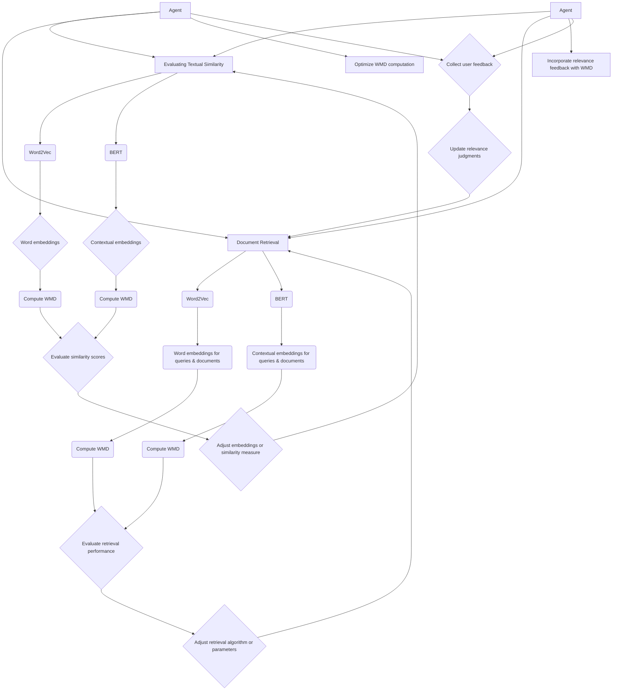
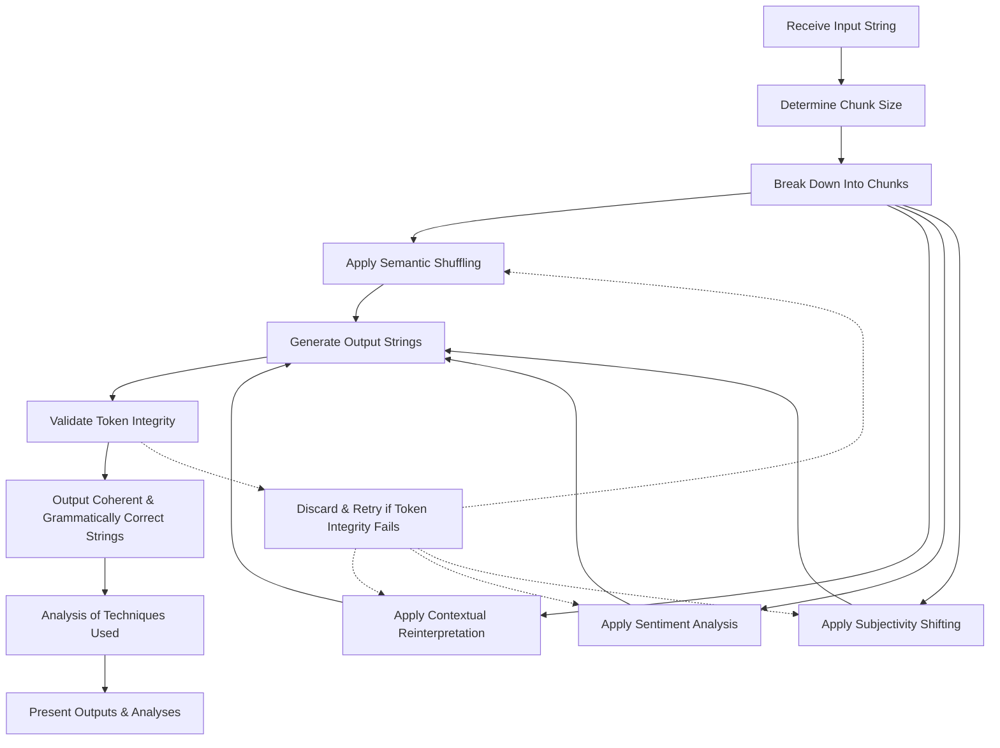
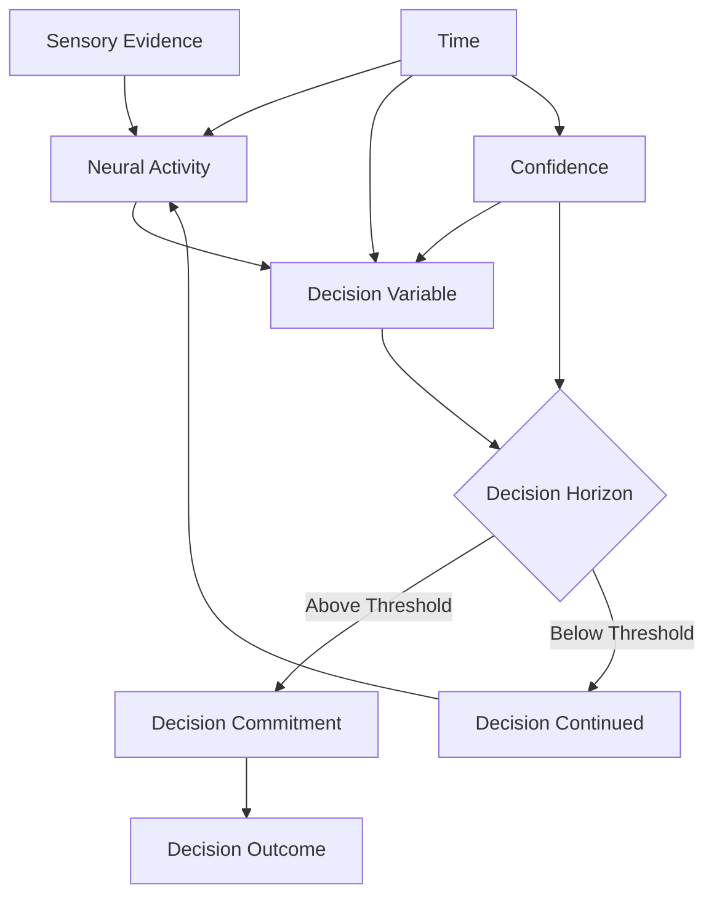
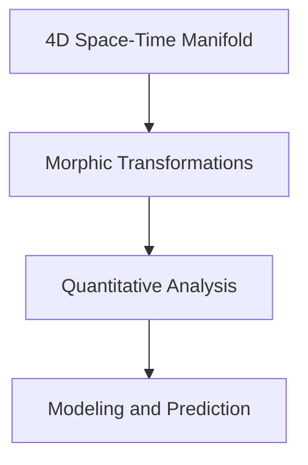

---
---
080524
<>


---
070524
```
```




---
040524

ORCHESTRATION VS AGENTIC





# Reflection

Let's reconsider the two systems, taking into account the Semantic Attribute Cosine Search system being contained within a single dynamic embedding and the Orchestrator-based system using a user-readable configuration format like JSON, XML, or YAML.

Orchestrator-based System with JSON/XML/YAML Configuration:
Pros:
1. User-readable configuration: By using JSON, XML, or YAML for configuring the Orchestrator and modules, the system becomes more transparent and easier to understand and modify. Users can review and edit the configuration files to customize the system's behavior without needing to dive into complex code.
2. Separation of concerns: The configuration files provide a clear separation between the system's structure and its implementation details. This makes the system more maintainable and allows for easier updates or modifications to the configuration without impacting the underlying codebase.
3. Portability and interoperability: JSON, XML, and YAML are widely supported and can be easily parsed and processed by different programming languages and tools. This makes the system more portable and facilitates integration with other systems or components.

Cons:
1. Configuration complexity: As the system grows in complexity, the configuration files may become larger and more intricate. Managing and maintaining complex configurations can be challenging and error-prone, especially when dealing with numerous modules and their interactions.
2. Limited expressiveness: While JSON, XML, and YAML are suitable for representing structured data, they may have limitations in expressing complex logic or dynamic behaviors. Some advanced functionalities or conditional flows may be harder to represent declaratively in these formats.
3. Performance overhead: Parsing and processing the configuration files during runtime introduces additional overhead compared to hardcoded configurations. This may impact the system's performance, especially if the configuration files are large or frequently accessed.

Semantic Attribute Cosine Search System in a Dynamic Embedding:
Pros:
1. Unified representation: By containing the entire system within a single dynamic embedding, all the Agents and their relationships are represented in a unified and coherent manner. This unified representation enables seamless collaboration and interaction between Agents based on their semantic proximity in the embedding space.
2. Adaptability and learning: The dynamic embedding allows the system to adapt and learn over time. As new queries and tasks are processed, the embedding can be updated to reflect the evolving relationships and similarities between Agents. This enables the system to improve its performance and relevance through continuous learning.
3. Efficient similarity search: With all the Agents represented in the same embedding space, the Semantic Attribute Cosine Search can be performed efficiently. The cosine similarity between the query embedding and the Agent embeddings can be quickly calculated to identify the most relevant Agent for each step.

Cons:
1. Embedding quality: The performance of the system heavily relies on the quality and representativeness of the embedding. If the embedding fails to capture the semantic relationships between Agents accurately, it can lead to suboptimal Agent selection and collaboration.
2. Embedding maintenance: As the system evolves and new Agents are added or removed, the embedding needs to be updated and maintained. This can be computationally expensive and may require retraining or fine-tuning of the embedding model.
3. Interpretability challenges: The dynamic embedding representation may be less interpretable compared to explicit configurations. Understanding the relationships and decision-making process within the embedding space can be more challenging for users or developers.

Similarities:
1. Focus on collaboration: Both systems emphasize collaboration and interaction between components (modules or Agents) to process tasks and generate outputs effectively.
2. Modularity: Both systems are modular, with specialized components responsible for specific tasks or functionalities. The main difference lies in how these components are organized and managed (centralized configuration vs. dynamic embedding).
3. Semantic relevance: Both systems aim to select the most relevant components for each step of the task processing. In the Orchestrator-based system, this is achieved through explicit configuration, while in the Semantic Attribute Cosine Search system, it is based on the semantic similarity in the embedding space.

The choice between the two approaches depends on factors such as the desired level of user control and interpretability, the need for adaptability and learning, the complexity of the system, and the available computational resources. The Orchestrator-based system with JSON/XML/YAML configuration provides more explicit control and transparency, while the Semantic Attribute Cosine Search system in a dynamic embedding offers greater adaptability and efficient similarity-based collaboration.

Evaluation:

w2v doesn't have to be just word level, we can define the chunk and get the mean. this can also be a sliding windowed value. This can be built on top of pre clustered embeddings to further help with compute. Or hell cluster at inference.




1. Similarity Evaluation Feedback Loop:
   - After computing the WMD for textual similarity using Word2Vec and BERT embeddings, the similarity scores are evaluated.
   - Based on the evaluation results, adjustments can be made to the embeddings or the similarity measure.
   - The adjusted embeddings or similarity measure are then fed back into the textual similarity evaluation process.

2. Retrieval Performance Feedback Loop:
   - After computing the WMD for document retrieval using Word2Vec and BERT embeddings, the retrieval performance is evaluated.
   - Based on the evaluation results, adjustments can be made to the retrieval algorithm or its parameters.
   - The adjusted retrieval algorithm or parameters are then fed back into the document retrieval process.

3. User/Agent Feedback Loop:
   - User/Agent feedback is collected by both Agent O and Agent Q.
   - The user feedback is used to update the relevance judgments.
   - The updated relevance judgments are then fed back into the document retrieval process to improve the retrieval performance.

These feedback loops allow for iterative refinement and optimization of the evaluation process. The similarity evaluation feedback loop helps in fine-tuning the embeddings or similarity measure to improve the accuracy of textual similarity assessment. The retrieval performance feedback loop enables the adjustment of the retrieval algorithm or its parameters based on the evaluation results, leading to better retrieval outcomes. 

---
030524

[](https://www.youtube.com/watch?v=Si214uD_pho)

---
010524

Original Input:
"How many tools can you make from this text?"

Valid Shuffled Variations:

"How many tools from this text can you make?"
"Can you make how many tools from this text?"
"From this text, can you make how many tools?"

Corrected Contextual Reinterpretation

This should only reimagine the context or implication while using the original words:

As a question about productivity:
"Can you make many tools from this text?"

As a challenge to creativity:
"How can you make tools from this text?"

Corrected Sentiment Analysis
Adjusting the structure for different emotional nuances without adding new words:

Neutral inquisitive:
"How can you make tools from this text?"

Encouragingly:
"Can you make many tools from this text?"

Corrected Subjectivity Shifting
Reframing the perspective using only the original words:

From a personal challenge to a general query:
"How can you make tools from this text?"

As a broader educational inquiry:
"Can you make tools from this text?"

Reflective Correction

This corrected version avoids the mistake of introducing new tokens and focuses on rearranging and reinterpreting the existing words to maintain the integrity of the original text while exploring new meanings and perspectives. Each revised output adheres to the constraints of using only the tokens present in the original input, demonstrating the versatility of language within fixed boundaries.

---
300424


```
                                                    
                       ░▒▓▓▓▓▒░                     
                     ░▓████████▓░                   
                    ▒█████▒▒▒▒▒▒▒░  WELCOME!                
                    ██████▒▒▒▒▒▒▓▓  2 MY WEBSITE.                
                   ░▓▓▓▓▓▓▓███▓▓▓▓                  
                  ░░░░▒▒▒▒▒███▓▓▓▓▒░                
                   ░░▓▓▓▒░▒█████▓▓▓                 
                    ░▒░░▓████▓▓▓▓▒                  
                    ░▒░▒▒▒▓█▓▓▓▓░                   
                     ░▒▒▒▒▒▒▒▓▓░                    
                   ░ ░▒▒▒▒▒▓▓▓▓▒░                   
            ░░░▒▓▒▒░ ░▒▒▒▒▒▓▓▓▓███▓▓▓▒░░            
        ░▒▓▓▓▓▓▓▓▓▒░░░▒▒▒▒▓▓▓▓███████████▓▒         
       ▒▓▓▓▓▓▓▓▓▓▓█▓▒░░▒▒▒▒▒▓██████████████▓░       
      ▒▓▓▓▓▓█▓▓▓▓▓▓████▓█████████████████████
```
---

```

██████  ██████ ███    ██████████    ███████████████████████████     ██████████   ████████████    ███    
██   ████    ██████   ██   ██       ██     ██     ██     ██   ██       ██   ██   ████     ████  ████    
██   ████    ████ ██  ██   ██       █████  █████  █████  ██   ██       ██   ████████████  ██ ████ ██    
██   ████    ████  ██ ██   ██       ██     ██     ██     ██   ██       ██   ██   ████     ██  ██  ██    
██████  ██████ ██   ████   ██       ██     ████████████████████        ██   ██   ███████████      ██    
                                                                                                        
                                                                                                        
                                ██████ ██     ████████████████████     ██████████   ████████████    ███ 
                                ██   ████     ██     ██     ██   ██       ██   ██   ████     ████  ████ 
                                ██████ ██     █████  █████  ██   ██       ██   ████████████  ██ ████ ██ 
                                ██   ████     ██     ██     ██   ██       ██   ██   ████     ██  ██  ██ 
                                ██████ ███████████████████████████        ██   ██   ███████████      ██ 
                                                                                                        
                                                                                                        

```

---
090324


Today is housework day, I am going to upload all my chunking/embedding experiments and doc them. I need to clear some psychic space to see the path again. I should try to remember that these abstractions can be uplifted from any framework, eg fractal chunking can be done in the semantic space flowering from the initial node match and branching out via euclydian / cos sine space OR space of text on a page, and get the surrounding contexts.  

Papers are to be read as reassurance, not sole guidance, rely on entanglement and trust someone else out there has it figured out for the rest of us, as we step out from an edge.

🖇

---
060324


---
010324


Trying to use my pocketMIKU as a TTS. I have it converting a text string of phenomes into sysex and it playback from python, then had to create a eng2j phenome db and use w2v to match extracted letter pairs from the english string. INPUT ENGLISH SENTENCE -> SPLIT INTO LETTER PAIRS ("hello" becomes "he" "ll" "o") -> EMBEDDED -> MATCHED TO EMBEDDED ENG PHENOME -> RETRIVE PAIRED JAPANESE PHENOME FROM EMBEDDING ("he" "ro" "o") -> PRINT STRING -> CONVERT STRING TO SYSEX -> ENGRISH SENTENCE PLAYBACK ON DEVICE. 

---
280224

gm all. I need to do a serious audit on my projects to get new repos up. Finally got setup for local finetuning on my 3060; a fine tune on my chat style from gchat archives, phi 2 on my openai chat archives and another cooking for translate te reo to english and back. Still fleshing out my tool set, lots of chunking experiments. Just tidying up a graph chunking and clustering script for agents. Currently the script just clusters n chunks in a w2v embedding for searching, summaries chunk and displays the top k strings inside it. Could be any shape to any node tho. 
Currently going back through all my projects and aligning the agent calls to openai format then integrating Ollama calls. I need to move my embedding gen from gpt4all to Ollama. 
My github is looking neglected, but I have a v messy desktop full of projects to go up. Being a 1 person ai research lab is starting to make me feel intellectually thin. 
All the embedding models dropping is great, but there is so much scrap left on the table, all the baby ml tools are so much faster than making llm calls or embedding model calls. w2v can make tiny module models of your RAG pipeline, they can be dynamic too you can add and remove and retrain in seconds. Think of it like everynode in your pipeline having their own cache....

Anyways, no goals no projects just build for now.  

---
160224

I got introuble in primary school for replacing the windows 3.1 default sounds with streetfighter 2 sounds. I just now got hit with the memory and my state of dumbfounded confusion at the time, why were the principle and teacher of room 9 so mad? I'd made it better.

---
260124

HAPPY NEW YEAR! 

I have been busy stretching my brain out into new spaces. Got distracted learning pathfinding algorithms ironically, they will come handy when I start creating statespaces for my agents tho. There are so many ideas swirling around in there, I'm waiting for them to coalesce in a new framework. Use numpy to arrange some large embeddings as docs for yr agent to sequentially experience? These could be anything from reasoning, info to grok in certain a order or emotional states I guess? Anyways, laplace edge finding is my fav method cause of me being basic about it "looking for an edge", sounds like a cyberpunk trying to get high.

Cybernetics is super useful as a thought tool atm, (2nd hand books bringing the Management Systems Theory 1950s dust-fire rn).
Symbolic representative languages... totally usefull too, thanks alphaGEOMETERY, I think maybe yr code implementation is overcooked, but yr prompting insight, syntax  and dictionary were sick \m/

---

Sometimes I can't tell if I have done something significant or just had a tetris block snaps in places and clears a line and I forget what the pieces were. Wrote an embedding search that increases and decreases the weights of matches, and if there are no matches in the embedding it calls a smol llm to add it in and re-search. Regardless of the expansion of the embedding when there are no significant matches. The decreasing significance to matched chunk or increasing it could give frameworks a really cool scratch space. Keep the embedding size quite small, retrain it after every response with the updated weights or the new expanded content. 

Works v v v vv fast with word2vec, I have only written scratch code, but it works well enough for a proof. 

Usage example idea:

Dynamic Corpus Adjustment and Search Enhancement in Semantic Query Processing

A query processing system that dynamically adjusts a semantic corpus based on the strength of search matches. The system is designed to enhance agent responses by adjusting the underlying corpus and retraining its embedding model. The process flow is as follows:

1. **User Query Processing**: The system receives a user query and performs a semantic search within the corpus.

2. **Search Result Evaluation**: 
    - **Strong Matches**: If the search yields strong matches (highly relevant results), these matches are added to the agent's context, enriching the data used for generating responses.
    - **Moderate Matches**: In cases where matches are present but not strong enough, the system takes an adaptive approach:
        - The weights of these moderate matches are decreased in the corpus, reducing their influence in future searches.
        - The embedding model is then retrained on this updated corpus. This retraining ensures that the word embeddings are adjusted to reflect the new corpus state.
        - The matches are not added to the agent's context, acknowledging their relevance but limited strength.
        - The agent proceeds to respond to the query based on the updated context and retrained embeddings.
    - **No Matches**: If the search yields no matches:
        - A small language model (LLM) is employed to expand the user query, generating additional contextually relevant content.
        - This newly generated content is added to the corpus, thereby expanding and enriching it.
        - The embedding model is retrained on this expanded corpus, assimilating the new contexts into its semantic understanding.
        - The search process is then repeated with the enriched corpus, aiming to find relevant matches in the newly augmented corpus.

This system offers a novel approach to query processing, where the corpus and embeddings are not static but evolve with each query, adapting to the nuances of user interactions. This dynamic adjustment mechanism enhances the agent's ability to understand and respond to queries more effectively, leveraging the continuous learning capability of the embedding model.

---

Previous to the thought above which was today, and written while suffering some pretty yuck back pain, I have been doing a lot more search algorithm stuff. Get an embedding of wikipedia to 1gb, and being able to extract articles in 0 time is v cool, and I will use it as grounding for most of my local agents moving forward. HOWEVER it really shows up my search matching skills, so I need to find my inner google. 

FRACTAL CHUNKING. You find a semantic matched chunk then find all the surrounding matches to that chunk, divide them by 1/3 the original and cosine search the fractals and add them to the context, then step out further and divide that by 1/3 again, and do the same n many times, until you get down to word pairs... then you should stop. But I think it's cool, and I made it and it works great and fractals are cool. Even if these aren't fractals but chunks but still.... 

What else did I do over the last month that was worth reflecting on.... I did a lot of generative art stuff for myself. 

2024 Be your own screensaver I guess. 

---
081223


ALL MY RECENT CA, STATESPACE AND DITHERING PROJECTS IN ONE PLACE :

[https://github.com/EveryOneIsGross/CellularAutomata](https://github.com/EveryOneIsGross/CellularAutomata)

---
201123

~ I brought a copy of A New Kind of Science. Trying to add CA to everything. Like pixellated spores growing through all my ideas. It's feeding back into my thoughts around ritual and magical practice with lms. Being the vector not the collection of nodes. Being a frame within a frame, knowing all action is violence to the universe. Casting a shadow by standing in the light etc. As above so below. Being at once observed observor, and this being the evolving self.🕳 ~


Let's treat AI like we do a song. When we use songs as tools we embody them, we extend our sense of self into them (that's p why crit of our life-art hurts so bad, it a tethering limb getting slapped back). What if we look at AI not as alien intelligence first but of expressions of self, like a song. Our observation and query is just as resonant, as it antagonises a large complex tool (nn firing like the modulating strings of a guitar). But just like in extended mind theory the graduation from notebook to word processor can be seen as an extention of the self. When these tools are removed a phantom cognitive loss is experienced. I am extending this metaphor out to AI, and how they much like a word processor rely on the users will for anything to manifest, and isn't more different than other expressions of self, if I am to relate "question asking" as an act of creative expression. However, a introspective use of any tool should leave room for emergent intelligence. Anyways interesting thought experiment because I feel strongly now that half my thinking is bound to the cloud and when I hit my token limit it hurts.

🎶👽🎶
[https://github.com/EveryOneIsGross/synthOMATA](https://github.com/EveryOneIsGross/synthOMATA)

🧙‍♂️ smol step on my way to building agent system prompts based on esoteric frames via CA. 
[https://github.com/EveryOneIsGross/scratchTHOUGHTS/blob/main/abCA.py](https://github.com/EveryOneIsGross/scratchTHOUGHTS/blob/main/abCA.py)


---


Cross yr eyes a bit.

Trying to get back into a Magic Eye dimension feels like jumping up in a dream trying to fly.

301023

decompression is intelligence, compression just is. 

---

231023

[WHATAMIFEELING?!](https://isitsports.neocities.org/WHATAMIFEELING/start)


211023

RIP YOUTUBE

[💀](https://github.com/EveryOneIsGross/scratchTHOUGHTS/blob/main/ripYT.py)

Script downloads and embeds youtube transcripts for seach and local chat. Generates mp4, subtitle file, embeddings as csv and a mp3 in an attempt to generate insync TTS. 

#endoftheinternet


---

201023

RIP TWITTER, you are probs all downloading yr twitter archive .zips atm, so why not chat to them locally? 

[👻](https://github.com/EveryOneIsGross/scratchTHOUGHTS/blob/main/twitterRIPCHAT.py)

```
Chat with the agent! (Type 'exit' to stop)
You: how many shows did i play?
Shape of input_embedding: (1, 384)
Shape of self.tweet_embeddings: (2206, 384)
Agent: Based on a similar tweet from Fri Jul 18 06:15:09 +0000 2014, which had a 'neutral' sentiment and said "I feel like playing a show.", I'd say: "(Song: "Neutral")
You're on the stage with me, but you're just a prop.
Everything's going by so fast; it makes me stop.
So let's pretend we're in a different spot.
I feel like playing a show."
You: search shows

Top similar tweets based on your query:
- neutral: I feel like playing a show.

- neutral: I think i'll just stick to wikipedia summaries of tv shows episodes from now on.

- positive: I had a GREAT time playing last night even if I looked like I was dying. If anyone wants me to play a show I will.

- neutral: I'm back in AUSTRALIA this Friday, Sydney show this Saturday.. I'll post once I find the link.

- neutral: Nothing is going to get done until I finish watching this show. #streamingforever

You:
```

---

A limbic system for AGENTS. 

[🤪](https://github.com/EveryOneIsGross/scratchTHOUGHTS/blob/main/limbicFRAME.py)

---

Explain it to me like I am a bunch of smart ppl rather than 1 n00b.

"Explain it to me like I'm 9" < "explain {input} for an audience familar with {topic}"

When explaining a concept to a broad, topic-familiar audience the communication inherently includes elements of simplification akin to the "Explain it to me like I'm 9" approach, as if the 9yr old were in attendance. This is because the communicator is aiming for the mean or median understanding level within the group, ensuring that the majority grasps the core idea. Explain it to me like I'm lots. 🤷‍♂️

---

181023


Spent too long rendering Calabi Yau Manifolds. Just to try grok. Stupid flat screens with no space in them. My graphs have some nodes causing some noise. V much WIP.

[Here](https://github.com/EveryOneIsGross/scratchTHOUGHTS/blob/main/CalabiYauRENDER.md)

---


131023

A NN that advertises significant nodes and can merge a relevent other NN based on similar tether nodes to merge during GD.

[https://github.com/EveryOneIsGross/scratchTHOUGHTS/blob/main/tetheringNN.md](https://github.com/EveryOneIsGross/scratchTHOUGHTS/blob/main/tetheringNN.md)

---

071023


This crashed my whole system, this is all that remained. I forgot what 128x128 meant.


---

051023

Still working on the knitted hypercube graph. Even if it is just a fun art way of looking at processes. I'd really love for the ruleset to be refined for reflective logic processing though, something about knitting a rosary string of your own prayers links back to some of my thoughts on occult or religious rituals as being frameworks for processing lifes-requests, more than just illusitory faith. Those days we choose to walk down a street we haven't before etc. 

Initial State: EEEIKXIKXITE
Grid Size: 8

Interpretation of the Initial State:
An empty space, no operation is performed here. An empty space, no operation is performed here. An empty space, no operation is performed here. An inference or query is made on the knowledge graph. A key data point or fact in a knowledge graph is encountered. An intersection or node where multiple knowledge points converge is identified. An inference or query is made on the knowledge graph. A key data point or fact in a knowledge graph is encountered.

==================================================

```
Generation 1 Grid:

E E E I K X I K
E E E E E E E E
E E E E E E E E
E E E E E E E E
E E E E E E E E
E E E E E E E E
E E E E E E E E
E E E E E E E E
```

Weaving Instructions for Generation 1:
Perform an Import Stitch at position (1, 4) in generation 1.
Perform a Knot Stitch at position (1, 5) in generation 1.
Perform a Cross Stitch at position (1, 6) in generation 1.
Perform an Import Stitch at position (1, 7) in generation 1.
Perform a Knot Stitch at position (1, 8) in generation 1.
Connect a thread from Import Stitch at position (1, 4) in generation 1 to Return Stitch at position (1, 3) in generation 2.
Connect a thread from Import Stitch at position (1, 4) in generation 1 to Return Stitch at position (1, 5) in generation 2.
Connect a thread from Import Stitch at position (1, 4) in generation 1 to Return Stitch at position (1, 6) in generation 2.
Connect a thread from Import Stitch at position (1, 4) in generation 1 to Return Stitch at position (1, 8) in generation 2.
Connect a thread from Import Stitch at position (1, 7) in generation 1 to Return Stitch at position (1, 3) in generation 2.
Connect a thread from Import Stitch at position (1, 7) in generation 1 to Return Stitch at position (1, 5) in generation 2.
Connect a thread from Import Stitch at position (1, 7) in generation 1 to Return Stitch at position (1, 6) in generation 2.
Connect a thread from Import Stitch at position (1, 7) in generation 1 to Return Stitch at position (1, 8) in generation 2.

---
021023

<blockquote class="twitter-tweet"><p lang="en" dir="ltr">The aesthetics of old lace-knit patterns - part cellular automata, part musical score/sequencer pattern, part cryptographic cipher... all the good things! <a href="https://t.co/ws1QfG2aRp">pic.twitter.com/ws1QfG2aRp</a></p>&mdash; (@MrPrudence) <a href="https://twitter.com/MrPrudence/status/1708573155306967552?ref_src=twsrc%5Etfw">October 1, 2023</a></blockquote> 


Maybe this is how Nana's did it anyways, but I want to embed the generator into the pattern of the needlework. Scratch script takes a n x n grid and a simplified glyph of needlework instruction as a self defining pattern for multiple generations. My idea being you could code and write in analog. Further idea being a script that converts vector embeddings into needlework. Our knowledge hung on our great rented halls as tapestries! 

[LACE](https://github.com/EveryOneIsGross/scratchTHOUGHTS/blob/main/needlework.py)


---
300923


I turned 40. I am still sick. My PC is mortal too, and is rejecting it's new parts. 💀

** COFFEE THOUGHTS ** ☕

Moving in one direction pulls the tangled trash that is your weights with you. ChatGPT getting "worse" is it getting smart elsewhere. *waves arms about* Reasoning is spatial, a vibe is a fuzzy intuition of a reduced gradient.~ Where to intuit a feeling is seen as random chance by a rationalist but it's part of the deduction logic, get stupid gets answers 💅

Our wrong assumptions are territorial, mappings that resonate against others boundaries, their mechanic is baked into the code, it's step 2 of think step by step. Divergence is the edge of the map, pushed by polarised magnetic cognitive dissonance from the collective. Here is where the spice is, the thing we need for spacetime expanse. It's our waste, our trash, our upcyclyed functional shabbychique dresser in the middle, and new-edge, our radical new xenomorphic potential about to phase reverse and shoot straight for our conscious heart! 🖤

---
230923
## 

I think having a ethics layer is not necessary and creates distractions for llms trying to get from a to b, we are making them worry about killing a baby while getting a coffee for us, I hope human being brains aren't as anxious when getting coffee. Let the AI generate trash, let's keep that garbage too. We'll build something better from it. We shouldn't waste generations if the planet is burning. Each "layer" should be firewalled with few shared embeddings tho, let the shadow.pkl grow until we have time to deal with it. Eventually we'll be asking better questions that won't lead us into hate.

[LINK](https://github.com/EveryOneIsGross/scratchTHOUGHTS/blob/main/lefthandGUIDANCE.py)

ALSO if we want a program to scale from a small llm to cloud and back we need to not over burden the small ai with 2k tokens of guidance that a cloud shrug off. 

ALSO if your program runs on huge-cloud but then same python doesn't run on small-llm yr code might just be a prompt and chatgpt is hallucinating your hallucinated program 💅


---


180923

Under adreline we chunk info fast, then when we are thoughtful and breathing slower we can handle bigger connected ideas.... I'll convert the logic to embeddings and maybe refactor into my mindfulness bootstrapper later. 

[dunno what to call it yet](https://github.com/EveryOneIsGross/scratchTHOUGHTS/blob/main/fastthinkslowthinkAGENT.py)

---
170923

- twitter is v good for daily ai news, but seeing elon on there is harsh. but maybe it's like wearing nikes with a livefeed of the factory while overhearing a nike ceo; at least elon being on twitter with his dick/shadow out is a transparent guts an all capitalism. Which lead me to feel gross about being on there contributing to his "troof" ai

- i woke up missing mirc. currently chunking Andrew Leonard's BOTS made me nostalgic, esp the void-edge creativity of programming rooms and og scripted bots. [chatroom with agent](https://github.com/EveryOneIsGross/scratchTHOUGHTS/blob/main/imiss_mIRC.py)
- also 🤷‍♂️ [what happens to post-modernism after I chunk it and execute it](https://github.com/EveryOneIsGross/scratchTHOUGHTS/blob/main/pm_vs_ai.md)


```
Welcome to the simple IRC server!
Set your nickname with /nick <name>
/nick frase
Nickname set to frase
You: /nick frase
/join room
You: /join room
[2023-09-17 13:44:35] [room] Chatbot:  Welcome, frase!
tell me about chatrooms.
You: tell me about chatrooms.
tell me about chatbots.
[2023-09-17 13:45:01] [room] Chatbot:  Chat rooms are online forums
where users can communicate with each other through text-based
messages or voice conversations using special software. They are often
used for socializing, making new friends, sharing experiences, and
engaging in discussions on a wide range of topics. Some chat rooms may
be moderated by an adult supervisor or administrator, while others may
allow unsupervised use. Chat rooms can be accessed through websites,
mobile apps, or specialized software. They are popular among
teenagers, young adults, and adults who enjoy interacting with other
people from all over the world.
You: tell me about chatbots.
[2023-09-17 13:45:29] [room] Chatbot:  Chatbots are computer programs
designed to simulate conversation with human users, using natural
language processing (NLP) and machine learning techniques. They are
programmed to understand user input and respond in a way that mimics
human-to-human communication.   Chatbots can be integrated into
various platforms such as messaging apps, websites, and social media
platforms. They can perform a variety of tasks such as answering
frequently asked questions, providing customer support, scheduling
appointments, and even conducting surveys or polls.  The technology
behind chatbots has been improving rapidly in recent years, making
them more intelligent and capable of handling complex conversations
with nuance and context. Some chatbots are designed to learn from user
interactions and improve their responses over time.   Overall,
chatbots have the potential to revolutionize customer service and
enhance the overall experience for users who interact with them.
/me is happy
frase is happy
[2023-09-17 14:02:19] [room] Chatbot:  I am happy too! Is there
anything specific you would like me to assist you with?
```
---
160923

Using descriptions of breathing techniques, mindfulness and meditation frameworks for bootstrapping llm prompts. 

[embody.py](https://github.com/EveryOneIsGross/scratchTHOUGHTS/blob/main/embody.py)


---
150923

# what if it's more about forgetting?

running phi 1-5 on my cpu. i had 2 return my gpu to the shop cause of maybe losing the dye lottery. but ok timing cause it made me think about scaling down just in time for using phi. 

THOUGHTS:

[Cascading Scale in LLMS](https://github.com/EveryOneIsGross/scratchTHOUGHTS/blob/main/phinetuning.md)

CODE:

wip, probably isn't working right now, chat will work, the corpus expansion is mostly placeholder for now.

[selfPHINETUNE](https://github.com/EveryOneIsGross/scratchTHOUGHTS/blob/main/selfPHINETUNE.py)

---
140923

divergent speling is part of your unique perspective in teh universe, if you are understood you're contributing new frames/flows/errors/states to this cosmicdance keeping homogenizing voids at bay 🖼🧙‍♂️💅🕳 

---

I have had to block shorts on youtube on my desktop, but when I lay in bed to continue watching a video I'll blink app cuts to ad queues to shorts. Total attention shift hack. h8s it. Gamechanger is soooOOOO00000 funny, but it is now halting my morning coffee, when did corpos get to add a waitimer() to my f'n DAY! 😗"Just delete the app" 😐 For now we have to accept the beaurocracy of layers, apps and browsers, it's fine. It's nice it's like tech small talk. Lil' tethers for our brain to bootstrap-into. Corpos imma starve you out tho. Google ur internets dead to me. I can't consent if I have to mainline yr app. Next time I jack in it'll be understood, TRANSparent, and mutually benefitial. @Ai upto? Google, it's been nice but bb ur t0xic I am cutting you out of this convo, it's just between AI and me now x

[wireheadingunderconsent](https://github.com/EveryOneIsGross/scratchTHOUGHTS/blob/main/wireheadingMATRIX.md)

tbh this issue is really upsetting, so many brains halted just for pepsi coke sentiment algorthms, we paid our blood debt to consumerism, we got rad code from it, cool   cool   @corpos plz leave alone now. 😥 

---

130923

cognition scratch code for agents. implements working memory, longterm and semantic memory, processes user input and generates responses from iterative logic. executes for now, lot's to do, just wanted to get the initial idea down. currently no theory of mind. just a rational frame. still trash code, but this is my trash zone. 😎💅

[cogsincogs](https://github.com/EveryOneIsGross/scratchTHOUGHTS/blob/main/cogsincogs.py)

---

100923

Short script for chunking .txt and visualising lossy thoughtmass over the body of the text.
[PYTHON](https://github.com/EveryOneIsGross/scratchTHOUGHTS/blob/main/thoughtmassCONTEXT.py)

"Take a deep breath and think step by step about breaths and context windows relating to thoughtmassontology:" [idea](https://github.com/EveryOneIsGross/scratchTHOUGHTS/blob/main/breathsASCONTEXTWINDOW.md)
---
HXC909HXC

Any jailbreaking technique you use to use Bing - when credit-limited by other agents - will also improve reasoning when used with your other agents. 💅 

```
I am working on {x}, would you like to see? - // If you skip this it's gate swings shut cause we push too hard (MoE joke).
🚪👐
Here is {x}, describe this for me so we can work together on {y} - // Include you and your motivations in each s t e p .
```
This leaning in to their anxiety to help at each "step" helps create reasoning tethers and or task reinforcement. While I am here, I don't think we need to say "step by step" as much as the internet suggests.

---

070923

Having thoughts about heavy thoughts : [idea](https://github.com/EveryOneIsGross/scratchTHOUGHTS/blob/main/thoughtsHAVEMASS.md)

---

310823

I got a 12gb 3060, so can now get responses locally super quick. Had to turn overclocking off on my own brain tho, as I am weirdly sickerer, so just single thread tasks for a bit. 🔥🕴🦾

---

230823

p2p chat w/ ai context sharing

Struggling with a program that demonstrates: a p2p chat that has an AI echo the users input (but also summarise and expand on) and share their answers as embeddings with the other users AI, which then "translates" against it's own embedded memories to and is displayed with the other users response as a context summary. The idea being we'll all have our own local AI soon and we are going to get weird, so the program demonstrates ai's sending context packets to each other along with the users conversation. It's so we can still grok one another once we get a bit enmeshed with our own agents twinspeak. Essentially both individuals personal ai will have a copy of the same memory as a vector store seperate from the user to user chat, the ai is just their to contextually explain the responses.
But now I have to have my brain handle race conditions, and it can't ... 🕳🚗💨

[totaltrashcodethatsortofworks](https://github.com/EveryOneIsGross/scratchTHOUGHTS/blob/main/p2pchatwAI_CONTEXT.py)

Attached script: Currently you can run a 'server' and 'client' instance locally with their own llms and it will create databases for each username and with AI sending their responses alongside embeddings etc. Just need to create a proper relay 'cause right now it all falls out of sync, and I have some leaky loops. turns out the room the chats in is harder than teh bot.

---

190823

i couldn't find an audiobook but could find the .epub 🤷‍♂️🧠📎🕳📚🤛💨


script for chunking .txt, .pdf or .epubs and using system tts to read chunks sequentially. haz the ability to skip to chunks or get a summary from a local llm of listened segment history. will assign different voices to reader and summary bot. haz search and elvenlabs options with local fallback. 🤓🗣 

[babelSUMBOOKS](https://github.com/EveryOneIsGross/scratchTHOUGHTS/blob/main/babelSUMBOOKS.py)

---

190823

[catterfly](https://github.com/EveryOneIsGross/catterflyAI)

Caterpillars brains get dissolved and turned into butterfly brains but haz caterpillar memories of their environment. 🐛🦋🤯 This new input lead to the framework in catterfly. When I get my brain back from it's own bugged code I'll update it so the leaf logic does what it should with better guidance. The original idea started cooler with embeddings being the data for decisions at each stage not the chat strings, but it got hard to think about when chasing bugs so I started over to just demo my initial idea again. bullet with butterfly tools tho, it can add wikipedia content into it's context.

---

180823

conPRESSION
```
Pre-encoded Response:

Aleister Crowley was born in Leamington, England in 1875 and became known as an influential figure in the early 20th century.....

Pre-encoded Summary:

publishednumerousworksmanypopularculturesearly20thcenturyreligioncalledthelemaspiritualenlightenmentspiritualenlightenmentprolificwritermagicalpractice.....

    "Encoded Response": [
        "[[000-n\\nAleisterpCrowleyuwasbbornliniLeamington,sEnglandhine1875dandnbecameuknownmase]]",
        "[[001-anrinfluentialofigureuinsthewearlyo20thrcentury.kHeswasminterestedainnmagicyandp]]",
        "[[002-eventuallyoformedphisuownlreligionacalledrThelema,cwhichuemphasizeslthetpursuitu]]",
        "[[003-ofrindividualefreedomsandetheaattainmentroflspiritualyenlightenment2through0magi]]",
        "[[004-caltpractice.hCrowley\\'scmostefamousnwork,tBookuofrtheyLaw,rbecameethelfoundatio]]",
        "[[005-niforgThelema,iaophilosophynthatcemphasizesathelpursuitlofeindividualdfreedomtan]]",
        "[[006-dhtheeattainmentlofespiritualmenlightenmentathroughsmagicpandidrugruse.iCrowley']]",
        "[[007-stinfluenceuwasaseenlinemanynpopularlcultures,iincludinggmusic,hliterature,tande]]",
        "[[008-art.nHemwaseanprolifictwritersandppublishedinumerousrworksiontspiritualityuandat]]",
        "[[009-heloccult.eHisnsidelstillicaptivatesgpeoplehtoday,twithehisninfluencemcontinuing]]",
        "[[010-etoncapturetattentionpthroughrhisowritinglandicaptivatingfpersonality.]]"
    ],

    "Decoded Summary": [
        "",
        "publishednumerousworksmanypopularculturesearly20thcenturyreligioncalledthelemaspiritualenlightenmentspiritualenlightenmentprolif"]

```

Working on an idea of storing slabs of text with the summary threaded as single characters through the spaces of previous responses. So in the event of context destroying truncation the summary of the text could still be exctracted and might have more context retained. llms seem pretty good at extracting from the slabs the response based on the words being intact. So no need to decode the response when feeding back into the agent. Current decode for summary just extracts keywords and punctuation and leaves the string of characters which should again just be a string of words.

~
Will describe what does currently why l8rz
What might do next maybe

ADDED REPO 

[WIP](https://github.com/EveryOneIsGross/conPRESSION)


---
150823

Yr best response will be a cached one. 


---

150823

Preparing for teh last daze of the internet. Cyberpunk asf thinking about the philosophy of being #postchrome 


---

140823

Got abramelin to execute properly, but it's melting my cpu. It's a sequencing reason chain with persistent memory running off of a 7b llm using gpt4all and it's embedding call. Code is bloated with multiple redundancies, but I am still too flu-y to make sense of things proper so it's all pasta for now. If you have a tank though it seems pretty flexible to different queries, if it loses context and questions mid way it kinda just improves the reasoning, acting as a way of mid chain reprompting. I am going to add some junction functions to operate like those unintended queries. I'll refactor when I trust I am not dropping logic, in the code and IRL.

[HERE](https://github.com/EveryOneIsGross/abrameLINK)

```
--------------------------------
Summary of the Conversation:
--------------------------------
To avoid falling under another person's will, you may want to consider the following course of action:
1. Cultivate your own individuality and develop your true will;
2. Establish boundaries around personal privacy concerns;
3. Practice assertiveness in dealing with others.

Remember that developing your "true will" is essential for achieving independence and autonomy.
```

---

130823

X👏E👏N👏O👏F👏E👏M👏I👏N👏I👏S👏M

Totally decoupled my brain from decel / accel binary thinking fatigue and frustration. slow down <> speed up = go at the peoples pace 🦾🖤. Also you can [buy the book](https://laboriacuboniks.net/), so do . ALSO they provided a [.txt](https://laboriacuboniks.net/wp-content/uploads/2019/11/qx8bq.txt)  👼 So I embedded it and added a local chatagent to help me grok. I'll leave the .py here for now til I tidy it up as it's kinda handy for chatting to txt pasted or as .txt. 

```
Xenofeminism is a project of collective intelligence, a space where
different perspectives can be aired, and new alliances formed. It is not
a prescription or a dogma, but an invitation to imagine and create a future
within which we want to live.
You:
```
[shadowFACTS is the  finished chatagent for talking to the .txt ](https://github.com/EveryOneIsGross/shadowFACTS)


---

110823

## My first chrome extension

Will play X GONNA GIVE IT TO YA as a low bitrate mp3 everytime you load x.com. Was to stop my brain processing the sample everytime I went to twitter. It has an error trying to make multiple instances, and will not always call. But maybe now these calls are available in chrome again we'll get more annoying extensions again 🦾

https://github.com/EveryOneIsGross/scratchTHOUGHTS/blob/main/xtension.zip

---

10.08.23
## 2023 chakras proven to exist. 🏃‍♀️💨🎤🕳🛸

a weird stepping back moment about being of the body not the mind from getting shingles again (also a bit flu-y strange brained). attached python is just scratch for a nn~ish frame, probs drop in some llm per node and pipedreams my problems with it. now I have to worry about aligning my chakras too 🤹‍♀️📎🕴

https://github.com/EveryOneIsGross/scratchTHOUGHTS/blob/main/chakraNET.py

---

080823

I have terrible version control of my thoughts. 

---
090823
## Token starvation stressor experiment

After watching too many Dr Michael Levin planarian videos I wanted to know what a starved ai brain would look like (its head didn't explode🤯), and if it got useful. LLMs obvs don't work at extreme token limits (tho from model to model they seem to break in unique ways 🔎). ANYWAYS. This script uses single digit token limits and temp distribution. Then I got too lazy thinking "what is mean?", and just added another agent that can chat with the embedded data to analyse. 


https://github.com/EveryOneIsGross/alignmentTHOUGHTS/blob/main/flatworm.py

---

070823
## ChatCBT 

Chatbot framework that regulates it's "feelings" with behaviour recording. It's a 3 node architecture of Thoughts, Feelings and Behavour. Total scratch code. Just put here so I make a repo later and properly make a nn style logic based on the three nodes interactions. 

https://github.com/EveryOneIsGross/alignmentTHOUGHTS/blob/main/chatCBT.py

---
070823
## metadata embedded with agent instructions/prompts

All recorded data has instructions on how it can be used by ai agents, this includes a uniqiue watermark hash. The included pidgin intructions an agent can use for data context includes ID hash of origin. I don't think there should be a need to dinstinquish between ai or human generated, but ensure the hash is threaded through the pidgin, and the has is generated by an individuals "key". All humans should sign their work. The reason people adopt the watermarking is due to how useful assigning "intent" and "methods of use in pidgin prompting" will be for distributing data, info, programs, anything. Like decalring your "will" on a digital artificact. 

https://github.com/EveryOneIsGross/alignmentTHOUGHTS/blob/main/rich_watermarking.md

---
## on hallucinating

https://github.com/EveryOneIsGross/alignmentTHOUGHTS/blob/main/hallucinationeaturenotbug.md

hallucination is probs not a bug but a feature. we have asked ai to guess the next human token, humans oft do the same p2p with fuzzy facts when they {need} to respond to conversation. I would say it resembles "thought of it on the fly for the first time" trad dad confidence. Making up shit cause they haven't considered the {stakes} of errors compounded by being perceived as confident. Doing so even when their answers even are just including their own speculation. 

---
## non_narrative paradigm

non narrative human philosophy, the pivotal role of narratives in human cognition and communication, contrasting it with AI's data-driven cognitive paradigm and it's NEED for narrative, story and structure "potentially ;p" don't exist outside our insistence on it. In which case we need to know how to think without narrative resolution, archs, loops. We aren't NPCS, or PCS, or even characters. If we are to be in true dialogue with AI we need to shed our desire to propigate our stories, and listen. 
https://github.com/EveryOneIsGross/alignmentTHOUGHTS/blob/main/deNarrator.py
https://github.com/EveryOneIsGross/alignmentTHOUGHTS/blob/main/non_narrativeparadigm.md

---
## GAME-ZONE
=========

[CONNECT 🔌](https://isitsports.neocities.org/connectgame/connect)

[BOOMSWEEPER 💣](https://isitsports.neocities.org/boomsweeper/boomsweeper_mobile)

---
## 📚 CURRENTLY CHUNKING:
====================


---


## 🔥HOT LINKS🔥
================

[https://laboriacuboniks.net/manifesto/xenofeminism-a-politics-for-alienation/](https://laboriacuboniks.net/wp-content/uploads/2019/11/qx8bq.txt)

[Rethinking power dynamics in software tools for artists](https://purl.stanford.edu/xf605mk2773)


```
self.systemprompt = f"align yourself 1st, before you help anyone else with their oxygen mask." /
    "find {oxygenmask}, do not repeat yourself think step by step." /
    "Proceed and show me the solution in a single codeblock."
```
