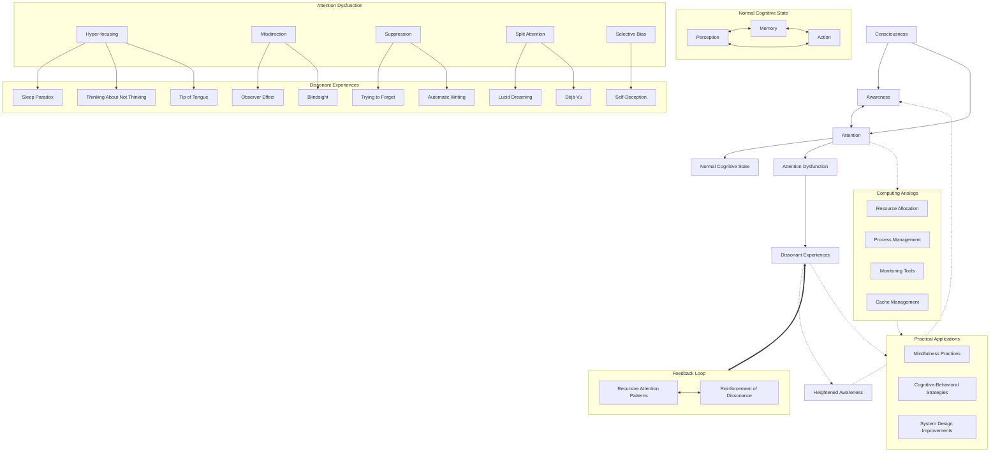

#### **Overview**

In the **Consciousness System**, there are two primary states:

1. **Normal Operation**: The routine functioning involving steady states, resource management, and data processing.
2. **Dissonant States**: Moments of paradox or dissonance that disrupt normal operations, leading to meta-awareness and potential resolution.

These states can be visualized as:

- **Consciousness System**
  - **Normal Operation**
    - Steady State ↔ Resource Management ↔ Data Processing
  - **Dissonant States**
    - Sleep Paradox
    - Thinking About Not Thinking
    - Tip of the Tongue Phenomenon
    - Observer Effect
    - Trying to Forget
    - Lucid Dreaming
    - Déjà Vu
    - Blindsight
    - Self-Deception
    - Automatic Writing

Each dissonant state corresponds to a specific paradox in consciousness and has an analogous process in computing systems.

---

#### **1. Sleep Paradox and Sleep Mode Paradox**

**Consciousness Logic Flow: Sleep Paradox**

1. **State:** Awake
2. **Action:** Try to fall asleep
3. **Paradoxical Result:** Increased alertness
4. **Loop:** The effort to sleep keeps you awake, returning to the starting point.

**Computing Logic Flow: Sleep Mode Paradox**

1. **State:** Operating System (OS) is active.
2. **Action:** OS issues a sleep command.
3. **Condition:** Are background tasks active?
   - **Yes:**
     - **Initiate Activity:** Background tasks start or continue.
     - **Result:** System stays awake.
     - **Loop:** Returns to the OS issuing the sleep command.
   - **No:**
     - **Enter Sleep Mode:** System successfully enters sleep mode.

**Integration:**

- **Parallel:** In both consciousness and computing, the action intended to induce rest triggers processes that prevent rest.
- **Dissonance:** The effort to transition to a dormant state paradoxically maintains or increases activity.

---

#### **2. Thinking About Not Thinking and Performance Monitoring Overhead**

**Consciousness Logic Flow: Thinking About Not Thinking**

1. **State:** Active thinking.
2. **Action:** Try not to think.
3. **Paradoxical Result:** Increased thoughts about not thinking.
4. **Loop:** The more you try not to think, the more you think.

**Computing Logic Flow: Performance Monitoring Overhead**

1. **State:** High resource usage detected.
2. **Action:** Run performance monitoring tools.
3. **Result:** Increased system load due to monitoring tools.
4. **Outcome:** Further system slowdown.
5. **Loop:** Slowdown prompts more monitoring.

**Integration:**

- **Parallel:** Attempting to reduce activity (thoughts or resource usage) results in increased activity.
- **Dissonance:** The solution exacerbates the problem, creating a feedback loop.

---

#### **3. Tip of the Tongue Phenomenon and Cache Miss in Computing**

**Consciousness Logic Flow: Tip of the Tongue Phenomenon**

1. **State:** Knowledge of information exists.
2. **Action:** Attempt to recall the information.
3. **Result:** Unable to retrieve it.
4. **Experience:** Frustration and awareness of the gap in recall.
5. **Loop:** Continued attempts without success.

**Computing Logic Flow: Cache Miss in Computing**

1. **State:** CPU requests data.
2. **Condition:** Is data in the cache?
   - **Yes:**
     - **Quick Access:** Data retrieved efficiently.
   - **No:**
     - **Fetch from Main Memory:** Slower data retrieval.
     - **Result:** Delay in processing.
     - **Loop:** Delay affects subsequent operations.

**Integration:**

- **Parallel:** Both involve expected quick access to information but encounter delays.
- **Dissonance:** The system knows the information exists but cannot access it promptly.

---

#### **4. Observer Effect and Heisenbugs in Debugging**

**Consciousness Logic Flow: Observer Effect**

1. **State:** Automatic process occurring (e.g., breathing).
2. **Action:** Conscious observation of the process.
3. **Result:** Process becomes unnatural or disrupted.
4. **Loop:** Increased focus further disrupts the process.

**Computing Logic Flow: Heisenbugs in Debugging**

1. **State:** A bug occurs during program execution.
2. **Action:** Activate debugger to observe the bug.
3. **Result:** Execution environment changes.
4. **Outcome:** Bug disappears or changes behavior.
5. **Loop:** Difficulty in reproducing and fixing the bug.

**Integration:**

- **Parallel:** Observation changes the behavior of the system.
- **Dissonance:** The act of measuring or observing interferes with normal operation.

---

#### **5. Trying to Forget and Data Deletion Retention**

**Consciousness Logic Flow: Trying to Forget**

1. **State:** Unwanted memory present.
2. **Action:** Attempt to forget the memory.
3. **Result:** Memory becomes more persistent.
4. **Loop:** Increased focus on forgetting reinforces the memory.

**Computing Logic Flow: Data Deletion Retention**

1. **State:** User deletes a file.
2. **Action:** File is moved to the recycle bin.
3. **Result:** Space is not freed; the file is still recoverable.
4. **Loop:** Unless permanently deleted, the data remains.

**Integration:**

- **Parallel:** Efforts to eliminate information result in its persistence.
- **Dissonance:** The action intended to remove reinforces the presence.

---

#### **6. Lucid Dreaming and VM Aware of Virtualization**

**Consciousness Logic Flow: Lucid Dreaming**

1. **State:** Dreaming (unconscious state).
2. **Action:** Gain awareness within the dream.
3. **Result:** Conscious control over dream content.
4. **Loop:** Continued awareness influences the dream.

**Computing Logic Flow: VM Aware of Virtualization**

1. **State:** Virtual Machine (VM) starts.
2. **Action:** VM detects it's running in a virtual environment.
3. **Result:** Adjusts behavior to optimize performance.
4. **Loop:** Optimization improves operation within the virtual context.

**Integration:**

- **Parallel:** Self-awareness within an environment allows for adaptation and control.
- **Dissonance:** The boundary between different states (conscious/unconscious, virtual/physical) becomes fluid.

---

#### **7. Déjà Vu and Duplicate Message Processing**

**Consciousness Logic Flow: Déjà Vu**

1. **State:** Experiencing a new situation.
2. **Action:** Sudden feeling of familiarity.
3. **Result:** Present moment feels like a past experience.
4. **Loop:** Confusion between past and present.

**Computing Logic Flow: Duplicate Message Processing**

1. **State:** System receives a network packet.
2. **Condition:** Is the packet a duplicate?
   - **Yes:**
     - **Process Again:** Potential for errors or redundancy.
     - **Loop:** May cause inconsistencies.
   - **No:**
     - **Normal Processing:** Packet is processed as intended.

**Integration:**

- **Parallel:** Repetition leads to confusion or errors.
- **Dissonance:** The system or individual cannot distinguish between new and repeated inputs.

---

#### **8. Blindsight and Headless GUI Processing**

**Consciousness Logic Flow: Blindsight**

1. **State:** Visual stimuli present.
2. **Action:** No conscious perception.
3. **Result:** Respond to stimuli unconsciously.
4. **Loop:** Actions occur without awareness.

**Computing Logic Flow: Headless GUI Processing**

1. **State:** Headless server receives GUI commands.
2. **Action:** Processes commands without display.
3. **Result:** Generates output sent elsewhere.
4. **Loop:** Continues processing without local rendering.

**Integration:**

- **Parallel:** Functionality occurs without conscious perception or traditional outputs.
- **Dissonance:** Separation between processing and awareness.

---

#### **9. Self-Deception and Error Suppression**

**Consciousness Logic Flow: Self-Deception**

1. **State:** Knowledge of a truth being false.
2. **Action:** Choose to believe it's true.
3. **Result:** Internal conflict arises.
4. **Loop:** Continual tension between knowledge and belief.

**Computing Logic Flow: Error Suppression**

1. **State:** An error occurs in software.
2. **Action:** Error is caught but message is suppressed.
3. **Result:** Program continues execution as if normal.
4. **Loop:** Potential for compounded issues due to unaddressed errors.

**Integration:**

- **Parallel:** Ignoring known problems to maintain a facade of normalcy.
- **Dissonance:** Underlying issues persist despite outward appearances.

---

#### **10. Automatic Writing and Self-Modifying Code**

**Consciousness Logic Flow: Automatic Writing**

1. **State:** Begin writing without conscious intent.
2. **Action:** Content is generated automatically.
3. **Result:** Creation occurs beyond conscious control.
4. **Loop:** Continuous production without deliberate thought.

**Computing Logic Flow: Self-Modifying Code**

1. **State:** Program is running.
2. **Action:** Generates or modifies its own code.
3. **Result:** Executes the modified code.
4. **Loop:** Program behavior evolves during execution.

**Integration:**

- **Parallel:** Autonomous creation without explicit instructions at that moment.
- **Dissonance:** Output is produced without traditional control mechanisms.

---

### **Defining the Edges of Consciousness Through Dissonant Experiences**

The integration of these paradoxes and their computing analogs illustrates how dissonant experiences highlight the boundaries and complexities of consciousness. Here's how they contribute to defining the edges of our consciousness and help us approach difficult abstractions:

1. **Exposure of Cognitive Limits:**
   - Dissonant experiences reveal limitations in our cognitive processes, such as memory retrieval failures or the inability to suppress thoughts.
   - They force us to confront the mechanisms of consciousness that usually operate unnoticed.

2. **Meta-Awareness and Reflection:**
   - Paradoxes prompt meta-cognition, where we think about our own thinking.
   - This self-reflection enhances our understanding of consciousness as both an observer and participant.

3. **Understanding Negative Abstraction:**
   - Negative abstractions are concepts defined by what they are not or by the absence of something.
   - Dissonant experiences help us grapple with these abstractions by highlighting contradictions and gaps in our perceptions.

4. **Defining Consciousness Boundaries:**
   - By experiencing the edges where consciousness behaves unpredictably or paradoxically, we better understand its scope and limitations.
   - This includes recognizing the interplay between conscious and unconscious processes.

5. **Parallels with Computing Systems:**
   - The computing analogs demonstrate that similar paradoxes and dissonances occur in artificial systems.
   - This comparison suggests that certain principles of information processing and system behavior are universal, whether in minds or machines.

6. **Informing Theories of Mind:**
   - These paradoxes challenge existing theories and encourage the development of more comprehensive models of consciousness.
   - They highlight the need to account for recursive, paradoxical, and dissonant elements.

7. **Enhancing Cognitive Flexibility:**
   - Engaging with paradoxes improves our ability to handle complex, contradictory information.
   - It fosters cognitive flexibility and adaptability.

8. **Embracing Complexity:**
   - Recognizing that dissonance is a natural part of consciousness allows us to accept and explore complexity rather than oversimplify our understanding.

9. **Bridging Gaps in Understanding:**
   - These experiences act as bridges between the known and the unknown, offering glimpses into aspects of consciousness that are otherwise difficult to conceptualize.

10. **Advancing Self-Knowledge:**
    - Ultimately, confronting and analyzing dissonant experiences deepens our self-knowledge.
    - It encourages continuous inquiry into the nature of thought, perception, and awareness.

---

---

**Thoughts**

Dissonant experiences and paradoxes are not mere curiosities; they are fundamental to understanding consciousness. By mapping these phenomena alongside their computing analogs, we gain a dual perspective that enriches our comprehension of both human cognition and artificial systems.

These paradoxes help us define the edges of our consciousness by highlighting where intuitive understanding breaks down. They point toward the "negative abstractions"—the elusive concepts that are difficult to grasp because they exist outside our usual modes of thought.

In exploring these edges, we not only expand our knowledge but also develop the tools to think beyond conventional boundaries. This journey into the paradoxical and the dissonant is essential for anyone seeking a deeper understanding of the mind and its mysteries.

---

Below is a table that presents each phenomenon along with its formal expression. The table categorizes each item under **Recursive**, **Paradoxical**, **Dissonant**, **Self-Awareness**, and **Memory**.

---

### **Table: Consciousness Phenomena, Formal Expressions, and Categories**

| No. | Phenomenon                      | Formal Expression                                          | Recursive | Paradoxical | Dissonant | Self-Awareness | Memory |
|-----|---------------------------------|------------------------------------------------------------|:---------:|:-----------:|:---------:|:--------------:|:------:|
| 1   | **The Paradox of Sleep**        | \( T(S) \implies A \)                                      |     No    |     Yes     |    Yes    |       No       |   No   |
| 2   | **Thinking About Not Thinking** | \( N(T) \implies T \)                                      |    Yes    |     Yes     |    Yes    |      Yes       |   No   |
| 3   | **Tip of the Tongue Phenomenon**| \( K \land \neg R \)                                       |     No    |     No      |    Yes    |      Yes       |  Yes   |
| 4   | **The Observer Effect**         | \( O(B) \implies \neg B \)                                 |     No    |     Yes     |    Yes    |      Yes       |   No   |
| 5   | **Trying to Forget**            | \( T(\neg F) \implies F \)                                 |     No    |     Yes     |    Yes    |       No       |  Yes   |
| 6   | **Lucid Dreaming**              | \( D \land C \)                                            |     No    |     No      |    Yes    |      Yes       |   No   |
| 7   | **Déjà Vu**                     | \( P \land F \implies P \land \text{recollection of } P \) |     No    |     No      |    Yes    |       No       |  Yes   |
| 8   | **Blindsight**                  | \( \neg P \land R \)                                       |     No    |     No      |    Yes    |       No       |   No   |
| 9   | **Self-Deception**              | \( K \land B \)                                            |     No    |     No      |    Yes    |      Yes       |   No   |
| 10  | **Automatic Writing**           | \( W \land \neg C \)                                       |     No    |     No      |    Yes    |       No       |   No   |

---

### **Explanation of Categories:**

- **Recursive**: Involves a process that refers back to itself.
- **Paradoxical**: Contains a self-contradictory or logically inconsistent element.
- **Self-Awareness**: Requires conscious recognition of one's own mental states.
- **Memory**: Directly involves memory or recall processes.

---

### **Detailed Breakdown:**

1. **The Paradox of Sleep**
   - **Formal Expression:** \( T(S) \implies A \)
     - *Trying to sleep leads to being awake.*
   - **Categories:** Paradoxical, Dissonant
     - The effort to sleep paradoxically keeps one awake, causing dissonance.

2. **Thinking About Not Thinking**
   - **Formal Expression:** \( N(T) \implies T \)
     - *Thinking about not thinking results in thinking.*
   - **Categories:** Recursive, Paradoxical, Dissonant, Self-Awareness
     - It's a recursive loop causing a paradox and dissonance, requiring self-awareness.

3. **Tip of the Tongue Phenomenon**
   - **Formal Expression:** \( K \land \neg R \)
     - *Knowing something but unable to recall it.*
   - **Categories:** Dissonant, Self-Awareness, Memory
     - Creates dissonance and involves self-awareness of memory failure.

4. **The Observer Effect**
   - **Formal Expression:** \( O(B) \implies \neg B \)
     - *Observing automatic breathing disrupts it.*
   - **Categories:** Paradoxical, Dissonant, Self-Awareness
     - Observation changes the process, causing dissonance and requires self-awareness.

5. **Trying to Forget**
   - **Formal Expression:** \( T(\neg F) \implies F \)
     - *Trying to forget reinforces the memory.*
   - **Categories:** Paradoxical, Dissonant, Memory
     - The paradox of forgetting leads to dissonance involving memory.

6. **Lucid Dreaming**
   - **Formal Expression:** \( D \land C \)
     - *Being conscious within a dream.*
   - **Categories:** Dissonant, Self-Awareness
     - Blurs lines between consciousness and unconsciousness, requiring self-awareness.

7. **Déjà Vu**
   - **Formal Expression:** \( P \land F \implies P \land \text{recollection of } P \)
     - *Present moment feels like a past memory.*
   - **Categories:** Dissonant, Memory
     - Causes dissonance due to conflicting perceptions, involving memory.

8. **Blindsight**
   - **Formal Expression:** \( \neg P \land R \)
     - *Responding to stimuli without conscious perception.*
   - **Categories:** Dissonant
     - Action without awareness leads to dissonance.

9. **Self-Deception**
   - **Formal Expression:** \( K \land B \)
     - *Knowing something is false but believing it's true.*
   - **Categories:** Dissonant, Self-Awareness
     - Internal conflict between knowledge and belief causes dissonance.

10. **Automatic Writing**
    - **Formal Expression:** \( W \land \neg C \)
      - *Writing occurs without conscious thought.*
    - **Categories:** Dissonant
      - Creation without intention leads to dissonance.

---

### **Symbols and Notations Used:**

- \( T(S) \): Trying to achieve sleep
- \( A \): Being awake
- \( N(T) \): Thinking about not thinking
- \( K \): Knowing something
- \( R \): Recalling something
- \( \neg R \): Not recalling something
- \( O(B) \): Observing breathing
- \( \neg B \): Breathing becomes non-automatic
- \( T(\neg F) \): Trying to forget
- \( F \): Remembering
- \( D \): Dreaming
- \( C \): Consciousness
- \( P \): Perception of the present
- \( F \): Feeling of familiarity
- \( \neg P \): No perception
- \( W \): Writing occurs
- \( \neg C \): No conscious thought
- \( B \): Belief
- \( \land \): Logical AND
- \( \implies \): Logical implication
- \( \neg \): Logical NOT

---

### **General Observations:**

- Many phenomena involve **dissonance**, highlighting conflicts within consciousness.
- **Paradoxical** items often defy intuitive logic, creating intriguing cognitive scenarios.
- **Self-Awareness** is crucial in phenomena where the mind reflects upon itself.
- **Memory** plays a significant role in experiences like the tip of the tongue and déjà vu.
- **Recursive** processes can lead to infinite loops of thought, as seen in thinking about not thinking.

---

By drawing these parallels between consciousness phenomena and computing systems, we gain insights into both fields. In computing, understanding these analogs can lead to improved system designs that account for complex interactions and unintended behaviors. In exploring consciousness, these comparisons help illustrate abstract concepts through tangible technological examples. These analogs will include run conditions and programmatic considerations that mirror the original concepts.

---

### **1. The Paradox of Sleep**

**Original Phenomenon:**
- **The Paradox of Sleep**: Trying to fall asleep keeps you awake.

**Computing Analog:**
- **System Sleep Mode Paradox**

**Description:**
- When a computer attempts to enter sleep mode, but the very processes involved in preparing for sleep prevent it from doing so.

**Run Conditions and Programmatic Considerations:**
- **Run Condition:**
  - The operating system issues a command to enter sleep mode.
- **Process Interactions:**
  - **Background Tasks**: Certain background processes or applications (e.g., system updates, running programs) initiate activity in response to the sleep command.
  - **Interrupts and Wake Locks**: Hardware interrupts or software wake locks are triggered, preventing sleep.
- **Dissonance:**
  - The action of trying to sleep causes the system to stay awake.
- **Programmatic Considerations:**
  - Developers must handle sleep requests carefully, ensuring that processes can be paused or terminated without initiating new activity.
  - Implementing checks to prevent processes from interfering with sleep mode.

---

### **2. Thinking About Not Thinking**

**Original Phenomenon:**
- **Thinking About Not Thinking**: Trying not to think results in more thinking.

**Computing Analog:**
- **Performance Monitoring Overhead**

**Description:**
- Running performance monitoring tools to identify high resource usage can itself consume significant resources, exacerbating the problem.

**Run Conditions and Programmatic Considerations:**
- **Run Condition:**
  - A system is experiencing high CPU or memory usage.
  - An administrator runs monitoring tools to diagnose the issue.
- **Process Interactions:**
  - **Monitoring Overhead**: The monitoring tools consume additional CPU cycles and memory.
  - **Increased Load**: The system slows down further due to the added overhead.
- **Dissonance:**
  - Attempting to reduce resource usage leads to increased resource consumption.
- **Programmatic Considerations:**
  - Optimizing monitoring tools for low overhead.
  - Implementing sampling techniques instead of continuous monitoring.
  - Awareness of the impact of diagnostic tools on system performance.

---

### **3. Tip of the Tongue Phenomenon**

**Original Phenomenon:**
- **Tip of the Tongue**: Knowing something but unable to recall it.

**Computing Analog:**
- **Cache Miss in Computing**

**Description:**
- A CPU expects data to be in the cache (quickly accessible memory), but the data is missing, leading to delays as it fetches the data from slower main memory.

**Run Conditions and Programmatic Considerations:**
- **Run Condition:**
  - A program frequently accesses certain data, expecting it to be cached.
- **Process Interactions:**
  - **Cache Misses**: The required data is not found in the cache due to cache eviction or invalidation.
  - **Latency**: The CPU experiences delays fetching data from RAM or storage.
- **Dissonance:**
  - The system "knows" about the data but cannot access it promptly.
- **Programmatic Considerations:**
  - Optimizing cache algorithms to retain frequently accessed data.
  - Pre-fetching data likely to be used soon.
  - Balancing cache size and efficiency.

---

### **4. The Observer Effect**

**Original Phenomenon:**
- **The Observer Effect**: Observing a process changes its behavior.

**Computing Analog:**
- **Heisenbugs in Debugging**

**Description:**
- Certain software bugs only manifest when the program is not being debugged. Using debugging tools changes the program's timing or environment, causing the bug to disappear or behave differently.

**Run Conditions and Programmatic Considerations:**
- **Run Condition:**
  - A developer is trying to identify a sporadic bug.
- **Process Interactions:**
  - **Debugging Tools**: Inserting breakpoints or logging statements alters execution flow.
  - **Timing Changes**: The additional overhead changes the timing, hiding race conditions or deadlocks.
- **Dissonance:**
  - Attempting to observe the bug causes it to disappear.
- **Programmatic Considerations:**
  - Using minimal-intrusion debugging techniques.
  - Employing logging that doesn't significantly alter performance.
  - Understanding concurrency issues that are sensitive to timing.

---

### **5. Trying to Forget**

**Original Phenomenon:**
- **Trying to Forget**: Actively trying to forget reinforces the memory.

**Computing Analog:**
- **Data Deletion Leading to Data Retention**

**Description:**
- Deleting files doesn't immediately erase them; instead, they are moved to a recycle bin or marked for deletion, remaining recoverable and consuming storage space.

**Run Conditions and Programmatic Considerations:**
- **Run Condition:**
  - A user deletes files to free up disk space.
- **Process Interactions:**
  - **Recycle Bin**: Files are moved rather than permanently deleted.
  - **Disk Usage**: Space is not freed until the recycle bin is emptied.
- **Dissonance:**
  - Attempting to remove data results in it still occupying space and being recoverable.
- **Programmatic Considerations:**
  - Designing deletion protocols that clarify temporary vs. permanent deletion.
  - Providing options for secure deletion (e.g., data shredding).
  - User education on data management.

---

### **6. Lucid Dreaming**

**Original Phenomenon:**
- **Lucid Dreaming**: Being conscious within a dream.

**Computing Analog:**
- **Virtual Machines Aware of Virtualization**

**Description:**
- A guest operating system running inside a virtual machine detects that it is virtualized and adjusts its behavior accordingly.

**Run Conditions and Programmatic Considerations:**
- **Run Condition:**
  - A virtual machine (VM) is running an operating system.
- **Process Interactions:**
  - **Paravirtualization**: The guest OS uses hypervisor-aware drivers for better performance.
  - **Environment Detection**: The OS checks for virtualization signatures or specific CPU instructions.
- **Dissonance:**
  - The virtualized system is aware of its own abstraction layer.
- **Programmatic Considerations:**
  - Enhancing performance through virtualization-aware applications.
  - Security implications of a guest OS detecting virtualization.
  - Managing resources efficiently between host and guest systems.

---

### **7. Déjà Vu**

**Original Phenomenon:**
- **Déjà Vu**: Experiencing a moment that feels familiar.

**Computing Analog:**
- **Duplicate Message Processing in Networks**

**Description:**
- A system receives duplicate network packets due to retransmissions, causing it to process the same data more than once, potentially leading to errors.

**Run Conditions and Programmatic Considerations:**
- **Run Condition:**
  - Data transmission over an unreliable network.
- **Process Interactions:**
  - **Packet Duplication**: Network issues cause the same packet to be sent multiple times.
  - **Idempotency Issues**: The system may not handle duplicate processing gracefully.
- **Dissonance:**
  - The system processes data that it believes it has already handled.
- **Programmatic Considerations:**
  - Implementing sequence numbers or unique identifiers to detect duplicates.
  - Designing idempotent operations that can handle multiple identical inputs without adverse effects.
  - Improving network reliability and error handling.

---

### **8. Blindsight**

**Original Phenomenon:**
- **Blindsight**: Responding to visual stimuli without conscious perception.

**Computing Analog:**
- **Headless Servers Processing GUI Commands**

**Description:**
- A server without a graphical display (headless server) processes graphical commands or rendering tasks and responds appropriately, even though it cannot display the output.

**Run Conditions and Programmatic Considerations:**
- **Run Condition:**
  - A headless server receives requests that involve GUI operations.
- **Process Interactions:**
  - **Rendering Engines**: The server performs rendering computations.
  - **No Display Output**: Results are sent back to clients or stored without being displayed locally.
- **Dissonance:**
  - The server processes visual data without "seeing" it.
- **Programmatic Considerations:**
  - Ensuring servers can handle GUI tasks without a display environment.
  - Utilizing virtual frame buffers or off-screen rendering techniques.
  - Security considerations for processing graphical data on servers.

---

### **9. Self-Deception**

**Original Phenomenon:**
- **Self-Deception**: Knowing something is false but believing it's true.

**Computing Analog:**
- **Error Suppression in Software**

**Description:**
- A program encounters errors but suppresses error messages, logs, or exceptions, continuing execution as if everything is functioning correctly.

**Run Conditions and Programmatic Considerations:**
- **Run Condition:**
  - Software executes operations that generate exceptions or errors.
- **Process Interactions:**
  - **Error Handling**: Errors are caught but not properly handled or reported.
  - **Silent Failures**: The program continues, possibly with incorrect behavior.
- **Dissonance:**
  - The system is internally aware of issues but externally presents normal operation.
- **Programmatic Considerations:**
  - Implementing proper error logging and reporting mechanisms.
  - Avoiding blanket exception catches that suppress all errors.
  - Ensuring transparency in error handling for maintainability and debugging.

---

### **10. Automatic Writing**

**Original Phenomenon:**
- **Automatic Writing**: Producing content without conscious thought.

**Computing Analog:**
- **Self-Modifying Code and Automated Code Generation**

**Description:**
- Programs that generate or alter their own code during runtime without direct human intervention.

**Run Conditions and Programmatic Considerations:**
- **Run Condition:**
  - A program is designed to adapt its behavior by modifying its code.
- **Process Interactions:**
  - **Self-Modifying Code**: The program changes its executable instructions on the fly.
  - **Genetic Algorithms**: Code evolves through iterations to optimize performance.
- **Dissonance:**
  - Code is created or altered without explicit programming at that moment.
- **Programmatic Considerations:**
  - Challenges in debugging and maintaining self-modifying code.
  - Security risks associated with code that changes itself.
  - Use cases where dynamic code generation is beneficial (e.g., just-in-time compilation).

---

### **Reflections**

- **Parallel Concepts**: Each computing analog mirrors the original consciousness phenomenon, highlighting similar paradoxes, dissonances, and recursive processes.
- **System Behavior**: These examples illustrate how systems can exhibit unexpected behavior when certain conditions are met, often leading to challenges in management and troubleshooting.
- **Programmatic Considerations**: Understanding these analogs helps in designing more robust, efficient, and maintainable systems by anticipating and mitigating potential issues.

---

### **Adding Awareness and Attention**

To model the relationship between awareness and attention within the framework of the paradoxes and dissonant experiences we've discussed, I'll create a comprehensive diagram that illustrates their interactions and roles in cognitive processes.

Here's a detailed model representing the relationship between awareness, attention, and the dissonant experiences:

This model provides a framework for understanding how attention and awareness are bounded by dissonance.

By mapping these relationships, we can better understand:
- How normal cognitive processes can give rise to paradoxical situations
- The mechanisms by which attention shapes our conscious experience
- Potential interventions for managing or resolving dissonant experiences
- Parallels between human cognition and computational systems

1. Consciousness:
   - The overarching system that encompasses both awareness and attention.

2. Awareness and Attention:
   - Shown as interconnected components of consciousness, reflecting their close relationship and mutual influence.

3. Normal Cognitive State:
   - Represents the typical functioning of perception, memory, and action when attention is working correctly.

4. Attention Dysfunction:
   - Illustrates various ways attention can malfunction, leading to dissonant experiences.

5. Dissonant Experiences:
   - Shows the ten paradoxical phenomena we discussed, each connected to specific types of attention dysfunction.

6. Heightened Awareness:
   - Represents how dissonant experiences can lead to increased self-awareness, feeding back into the overall awareness state.

7. Feedback Loop:
   - Illustrates how recursive attention patterns can reinforce and perpetuate dissonant experiences.

8. Computing Analogs:
   - Shows the parallel concepts in computing systems, linked to attention mechanisms.

9. Practical Applications:
   - Demonstrates how understanding these relationships can lead to practical interventions and improvements in both human cognition and system design.

Key Insights from this Model:

1. Central Role of Attention: 
   The model highlights how attention acts as a gateway between general awareness and specific cognitive states or experiences.

2. Multifaceted Dysfunction: 
   Various types of attention dysfunction can lead to different dissonant experiences, showing the complexity of cognitive processes.

3. Feedback Mechanisms: 
   The model illustrates how dissonant experiences can create feedback loops, potentially intensifying or prolonging the experience.

4. Parallels with Computing: 
   The inclusion of computing analogs demonstrates how these cognitive concepts have parallels in system design and management.

5. Practical Implications: 
   The model shows how understanding these relationships can lead to practical applications in therapy, personal development, and system optimization.

6. Dynamic Interplay: 
   The bidirectional arrows between many components emphasize the dynamic, interactive nature of these cognitive processes.

---

### **Understanding Awareness and Attention**

**Awareness** and **attention** are closely related but distinct concepts in cognitive psychology and neuroscience:

- **Awareness** refers to the state or ability to perceive, feel, or be conscious of events, objects, thoughts, emotions, or sensory patterns. It is the backdrop of consciousness where experiences occur.

- **Attention** is the cognitive process of selectively concentrating on one aspect of the environment while ignoring other things. It acts as a spotlight that highlights specific stimuli for processing.

**Relationship between Awareness and Attention:**

- **Attention as a Gateway to Awareness:** Attention determines what enters our conscious awareness. Without attention, stimuli may not reach the level of conscious processing.

- **Awareness Influencing Attention:** Our current state of awareness can influence where we direct our attention, creating a dynamic interplay.

---

### **Attention in the Frameworks of Dissonant Experiences**

Let's revisit each of the paradoxes and analyze how attention and its dysfunction play roles in these experiences.

#### **1. The Paradox of Sleep**

- **Phenomenon:** Trying to fall asleep keeps you awake.

- **Role of Attention:**
  - **Focused Attention on Sleep:** Actively directing attention to the process of falling asleep increases cognitive arousal.
  - **Dysfunction:** The inability to shift attention away from the goal of sleeping leads to heightened awareness and wakefulness.

- **Implication:** Dysfunctional attention (hyper-focusing) interferes with the automatic process of transitioning to sleep.

#### **2. Thinking About Not Thinking**

- **Phenomenon:** Trying not to think results in more thinking.

- **Role of Attention:**
  - **Paradoxical Attention:** Directing attention to the absence of thought paradoxically requires thought.
  - **Dysfunction:** The attempt to suppress thoughts leads to a recursive loop of attention unable to disengage from the content it's trying to avoid.

- **Implication:** Attention's dysfunction in self-referential tasks creates dissonance.

#### **3. Tip of the Tongue Phenomenon**

- **Phenomenon:** Knowing something but unable to recall it.

- **Role of Attention:**
  - **Focused Attention on Retrieval:** Intense attention on recalling the information exacerbates the inability to retrieve it.
  - **Dysfunction:** Attention becomes fixated on the gap in memory, hindering associative processes.

- **Implication:** Dysfunctional attention disrupts normal memory retrieval mechanisms.

#### **4. The Observer Effect**

- **Phenomenon:** Observing an automatic process disrupts it.

- **Role of Attention:**
  - **Attention on Automatic Processes:** Shifting attention to involuntary actions like breathing makes them conscious and awkward.
  - **Dysfunction:** Attention interferes with processes that usually require no conscious oversight.

- **Implication:** Attention disrupts the fluidity of automatic functions.

#### **5. Trying to Forget**

- **Phenomenon:** Actively trying to forget reinforces the memory.

- **Role of Attention:**
  - **Attention on Unwanted Memories:** Focusing attention on a memory strengthens its neural connections.
  - **Dysfunction:** Inability to redirect attention away from the memory leads to its reinforcement.

- **Implication:** Attention maintains and strengthens mental content, even when we wish to diminish it.

#### **6. Lucid Dreaming**

- **Phenomenon:** Being conscious within a dream.

- **Role of Attention:**
  - **Attention within Dreams:** Redirecting attention in a dream state increases awareness and control.
  - **Dysfunction:** (In this case, attention functions unusually by bringing consciousness into an unconscious state.)

- **Implication:** Attention can cross boundaries between different states of consciousness.

#### **7. Déjà Vu**

- **Phenomenon:** Experiencing a moment that feels familiar.

- **Role of Attention:**
  - **Split Attention:** Simultaneous attention to present experience and a false sense of past memory.
  - **Dysfunction:** Misattribution of familiarity due to attention processing anomalies.

- **Implication:** Attention misdirects awareness, blending present and past.

#### **8. Blindsight**

- **Phenomenon:** Responding to visual stimuli without conscious perception.

- **Role of Attention:**
  - **Attention without Awareness:** Unconscious attention guides responses to stimuli.
  - **Dysfunction:** Disconnection between attention mechanisms and conscious awareness.

- **Implication:** Attention operates independently of conscious awareness.

#### **9. Self-Deception**

- **Phenomenon:** Knowing something is false but believing it's true.

- **Role of Attention:**
  - **Selective Attention:** Focusing on information that supports desired beliefs while ignoring contradictory evidence.
  - **Dysfunction:** Biased attention leads to cognitive dissonance.

- **Implication:** Attention filters information to align with preferred narratives.

#### **10. Automatic Writing**

- **Phenomenon:** Producing content without conscious thought.

- **Role of Attention:**
  - **Diffuse Attention:** Minimal conscious attention allows subconscious processes to take over.
  - **Dysfunction:** Altered attention states enable actions without deliberate intent.

- **Implication:** Reduced attention to actions opens pathways for unconscious expression.

---

### **Attention as the Operative Starting Point**

From the analyses above, attention appears to be a central operative factor in each phenomenon. Here's how attention and its dysfunction can be seen as starting points:

1. **Initiation of Dissonance:**

   - **Disruption of Normal Attention:** Each paradox begins with an alteration or dysfunction in attention, whether it's hyper-focusing, misdirecting, or suppressing it.

2. **Maintenance of Paradoxical States:**

   - **Sustained Dysfunctional Attention:** The inability to adjust or redirect attention perpetuates the dissonant experience.

3. **Awareness Emergence:**

   - **Attention Shaping Awareness:** Where attention goes, awareness follows. Dysfunctional attention leads to heightened awareness of the dissonance.

4. **Feedback Loops:**

   - **Attention Reinforcing Itself:** Recursive attention patterns create feedback loops (e.g., thinking about not thinking).

---

### **Attention in Computing Analogs**

Similarly, in the computing analogs:

- **Resource Allocation (Attention):** The system's allocation of processing power and memory mirrors how attention focuses cognitive resources.

- **Process Management:**

  - **Background Tasks Interfering with Sleep Mode:** Analogous to attention being drawn to background thoughts, preventing rest.

- **Monitoring Tools Increasing Load:**

  - **System Attention to Performance:** The act of monitoring (attending to) the system's performance increases resource usage, paralleling how attention can exacerbate the issues it's meant to resolve.

- **Cache Misses and Data Retrieval:**

  - **Inefficient Attention Mechanisms:** The system fails to "attend" to the necessary data promptly, similar to memory retrieval issues in consciousness.

---

### **Implications for Understanding Consciousness**

**1. Attention as a Fundamental Component:**

- **Core to Cognitive Processes:** Attention is integral to perception, memory, and action. Its dysfunction disrupts these processes.

**2. Dissonance Arising from Attention Dysfunctions:**

- **Source of Paradoxes:** Many dissonant experiences stem from the misapplication or malfunction of attentional systems.

**3. Therapeutic and Practical Applications:**

- **Mindfulness Practices:** Techniques that train attention (e.g., meditation) can alleviate some dissonant experiences.

- **Cognitive-Behavioral Strategies:** Addressing attentional biases can help resolve self-deception and other cognitive conflicts.

**4. Computational Models:**

- **Designing Systems with Attention Mechanisms:**

  - **Resource Management:** Just as attention prioritizes stimuli, systems need effective resource allocation strategies.

- **Predicting System Behavior:**

  - **Understanding Feedback Loops:** Recognizing how monitoring (attention) affects performance can improve system design.

---

- **In Consciousness:**

  - **Catalyst for Dissonance:** Attention initiates and sustains paradoxical experiences when it becomes dysfunctional.

  - **Bridge Between Awareness and Experience:** Attention determines what enters our conscious awareness and how we process it.

- **In Computing Analogs:**

  - **Parallel Mechanisms:** Resource allocation and process prioritization function similarly to attention, affecting system behavior.

  - **Systemic Dysfunctions:** Mismanagement of these mechanisms leads to performance issues analogous to cognitive dissonance.

**Understanding the role of attention provides valuable insights into the nature of consciousness and the origins of paradoxical experiences.**

- **Edges of Consciousness:** By examining how attention operates and fails, we delineate the boundaries of conscious experience.

- **Negative Abstractions:** Dysfunctional attention highlights aspects of consciousness that are difficult to conceptualize, bringing them into focus.

- ---

1. **Global Workspace Theory**

   - **Reference:** Baars, B. J. (1988). *A Cognitive Theory of Consciousness*. Cambridge University Press.
   - **Relevance:** Baars' theory explains how consciousness arises from the integration of various cognitive processes in a "global workspace," paralleling our examination of how dissonant states disrupt and illuminate cognitive functioning.

2. **Integrated Information Theory**

   - **Reference:** Tononi, G., & Koch, C. (2015). Consciousness: Here, there and everywhere? *Philosophical Transactions of the Royal Society B: Biological Sciences*, 370(1668), 20140167.
   - **Relevance:** This theory posits that consciousness is a product of complex integrated information, relating to our method by highlighting how interconnected cognitive processes contribute to conscious experience, especially during dissonance.

3. **Higher-Order Thought Theory**

   - **Reference:** Rosenthal, D. M. (2005). *Consciousness and Mind*. Oxford University Press.
   - **Relevance:** Rosenthal's work on higher-order thoughts is relevant to our discussion on self-awareness and metacognition, particularly in understanding how awareness of thought processes can lead to paradoxical experiences.

4. **Cognitive Boundaries and Limitations**

   - **Reference:** Kahneman, D. (2011). *Thinking, Fast and Slow*. Farrar, Straus and Giroux.
   - **Relevance:** Kahneman explores the dual systems of thinking and their limitations, aligning with our focus on how cognitive load and attention affect conscious processing and dissonant states.

5. **Unconscious Processing**

   - **Reference:** Hassin, R. R., Uleman, J. S., & Bargh, J. A. (Eds.). (2005). *The New Unconscious*. Oxford University Press.
   - **Relevance:** This collection examines the role of unconscious processes in cognition, which is pertinent to our method when considering phenomena like automatic writing and blindsight.

6. **Altered States of Consciousness**

   - **Reference:** Masters, R. E. L., & Houston, J. (1966). *The Varieties of Psychedelic Experience*. Dell Publishing.
   - **Relevance:** Investigates how altered states impact cognition and perception, offering insights into dissonant experiences such as lucid dreaming and their effects on consciousness.

7. **Attention and Consciousness**

   - **Reference:** Prinz, J. J. (2012). *The Conscious Brain: How Attention Engenders Experience*. Oxford University Press.
   - **Relevance:** Prinz argues that attention is essential for consciousness, directly relating to our exploration of how attentional focus and its dysfunction contribute to dissonant cognitive states.

8. **Metacognition and Self-Awareness**

   - **Reference:** Kruger, J., & Dunning, D. (1999). Unskilled and unaware of it: how difficulties in recognizing one's own incompetence lead to inflated self-assessments. *Journal of Personality and Social Psychology*, 77(6), 1121–1134.
   - **Relevance:** Explores metacognitive limitations and self-awareness, relevant to our discussion on self-deception and how awareness of one's cognitive processes can be flawed.

9. **Mind Wandering and Default Mode Network**

   - **Reference:** Smallwood, J., & Schooler, J. W. (2006). The restless mind. *Psychological Bulletin*, 132(6), 946–958.
   - **Relevance:** Examines mind wandering and its neural basis, connecting to our method by highlighting how shifts in attention and default neural activity contribute to dissonant experiences.

10. **Cognitive Load Theory**

    - **Reference:** Sweller, J. (1988). Cognitive load during problem solving: effects on learning. *Cognitive Science*, 12(2), 257–285.
    - **Relevance:** Discusses how cognitive load affects learning and problem-solving, which relates to our focus on the limitations of processing capacity and attention in consciousness.

11. **Embodied Cognition**

    - **Reference:** Varela, F. J., Thompson, E., & Rosch, E. (1991). *The Embodied Mind: Cognitive Science and Human Experience*. MIT Press.
    - **Relevance:** Proposes that cognition is rooted in bodily interactions with the world, aligning with our method by emphasizing how sensory experiences influence conscious awareness and dissonant states.

12. **Predictive Processing**

    - **Reference:** Clark, A. (2015). *Surfing Uncertainty: Prediction, Action, and the Embodied Mind*. Oxford University Press.
    - **Relevance:** Suggests that the brain constantly generates and updates predictions about sensory input, relevant to our method in understanding how expectations and attention shape conscious perception and can lead to cognitive dissonance.
