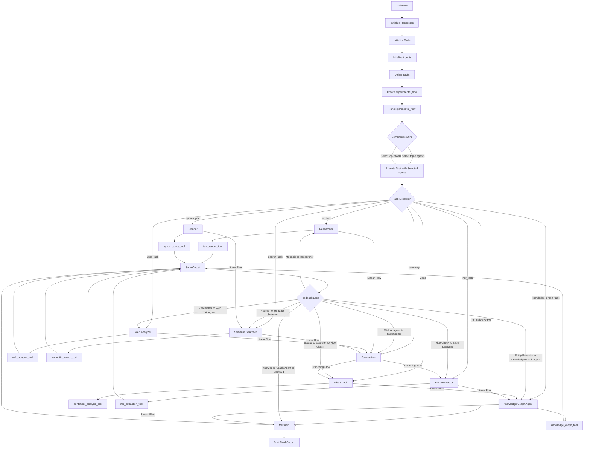

```mermaid
graph TD
    A[MainFlow] --> B[Initialize Resources]
    B --> C[Initialize Tools]
    C --> D[Initialize Agents]
    D --> E[Define Tasks]
    E --> F[Create experimental_flow]
    F --> G[Run experimental_flow]
    G --> H{Semantic Routing}
    H -->|Select top-k agents| I[Execute Task with Selected Agents]
    H -->|Select top-k tools| I
    I --> J{Task Execution}
    J -->|txt_task| K[Researcher]
    J -->|web_task| L[Web Analyzer]
    J -->|system_plan| M[Planner]
    J -->|search_task| N[Semantic Searcher]
    J -->|summary| O[Summarizer]
    J -->|vibes| P[Vibe Check]
    J -->|ner_task| Q[Entity Extractor]
    J -->|knowledge_graph_task| R[Knowledge Graph Agent]
    J -->|mermaidGRAPH| S[Mermaid]
    K --> T[text_reader_tool]
    L --> U[web_scraper_tool]
    M --> V[system_docs_tool]
    N --> W[semantic_search_tool]
    P --> X[sentiment_analysis_tool]
    Q --> Y[ner_extraction_tool]
    R --> Z[knowledge_graph_tool]
    T --> AA[Save Output]
    U --> AA
    V --> AA
    W --> AA
    X --> AA
    Y --> AA
    Z --> AA
    S --> AA
    AA --> AB{Feedback Loop}
    AB -->|Researcher to Web Analyzer| L
    AB -->|Web Analyzer to Summarizer| O
    AB -->|Planner to Semantic Searcher| N
    AB -->|Semantic Searcher to Vibe Check| P
    AB -->|Vibe Check to Entity Extractor| Q
    AB -->|Entity Extractor to Knowledge Graph Agent| R
    AB -->|Knowledge Graph Agent to Mermaid| S
    AB -->|Mermaid to Researcher| K
    K -->|Linear Flow| O
    L -->|Linear Flow| O
    M -->|Linear Flow| N
    N -->|Linear Flow| O
    O -->|Branching Flow| P
    O -->|Branching Flow| Q
    P -->|Linear Flow| R
    Q -->|Linear Flow| R
    R -->|Linear Flow| S
    S --> AC[Print Final Output]
```
